# House stuff

## Deck timeline

### All of these issues were not disclosed by previous owners

1.  8/24/2025 - Noticed main overhang from support post to support joist was sagging, and deck overhang had damages that needed fixing
    

       <figure style="width: 100%; text-align: center;">
          
          <figcaption>
            Overhang damages: Inspector noted this only after I pointed it out to him during the inspection   
          </figcaption>
       </figure>

       <figure style="width: 100%; text-align: center;">
          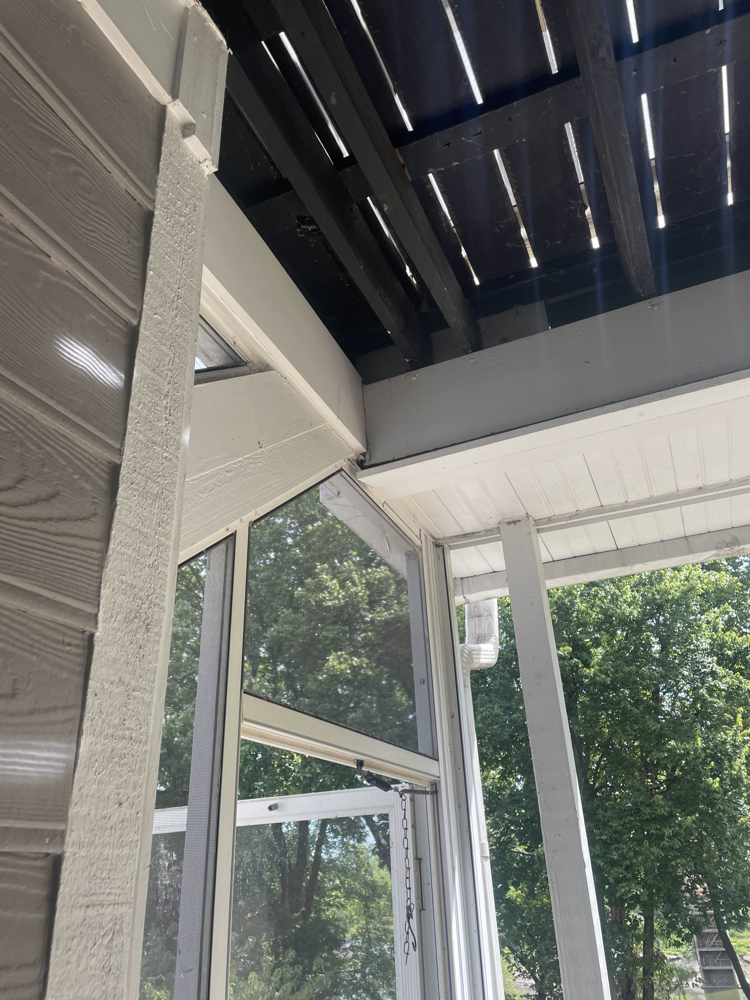
          <figcaption>
            Support Joist Sagging: Contractor Matt went to fix it and revealed the whole support was completely rotted
          </figcaption>
       </figure>

       <figure style="width: 100%; text-align: center;">
          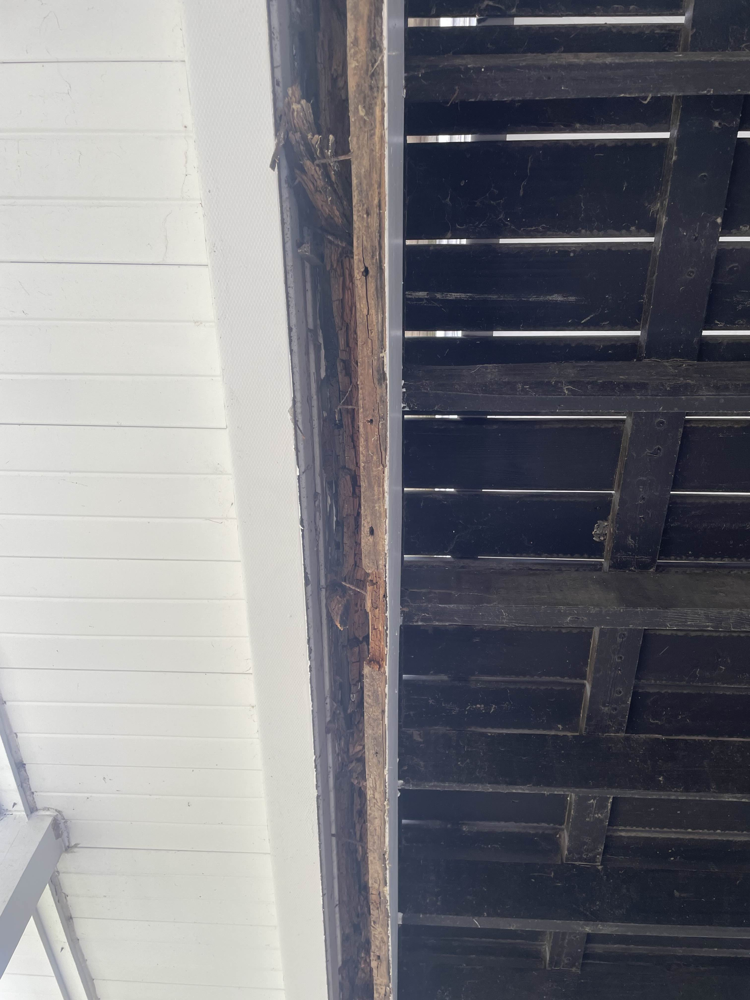
          <figcaption>
            Rotting Beam: Contractor Matt went to fix it and revealed the whole support was completely rotted
          </figcaption>
       </figure>
    

1.  8/24/2025 - Gusset that is apart of the balcony frame sagging causing extreme dip on the balcony floor
    

       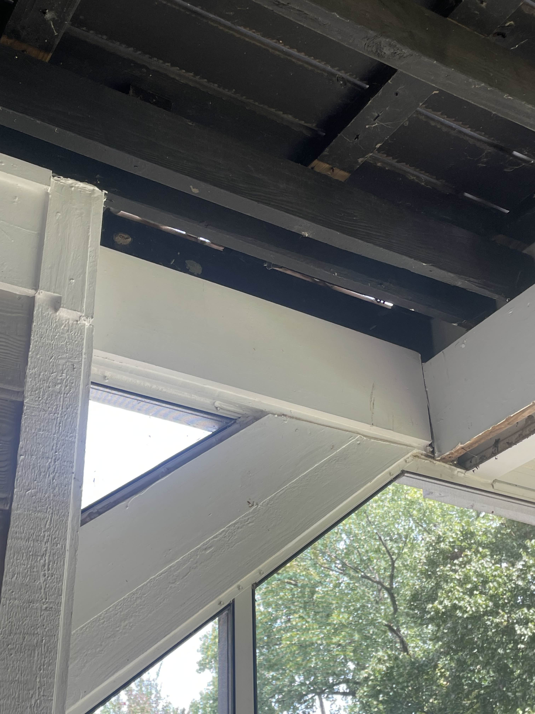
       <figcaption>Note: where the brown gaps are shown, goes across each beam where the flooring should be connected to the beam but is not due to rotting and sagging</figcaption>
    

1.  9/18/2025 - Rotting where the support beam on the balcony meets the roof
    

       <figure style="width: 50%; text-align: center;">
          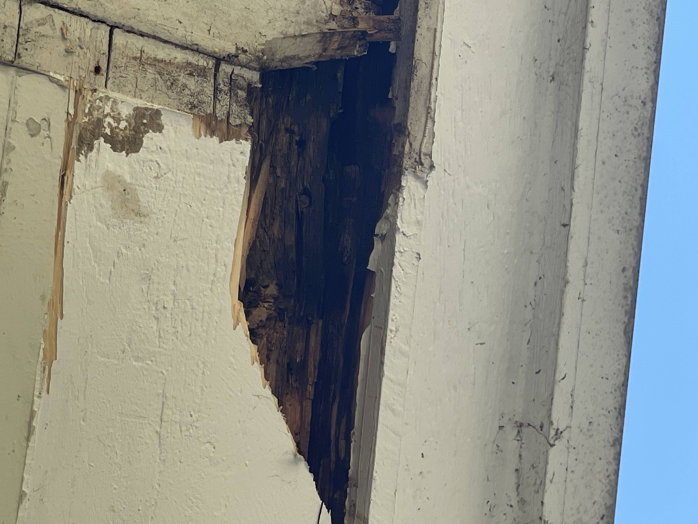
          <figcaption>Initial Findings (After pulling out just a piece of the rotting)</figcaption>
       </figure>

       <figure style="width: 50%; text-align: center;">
          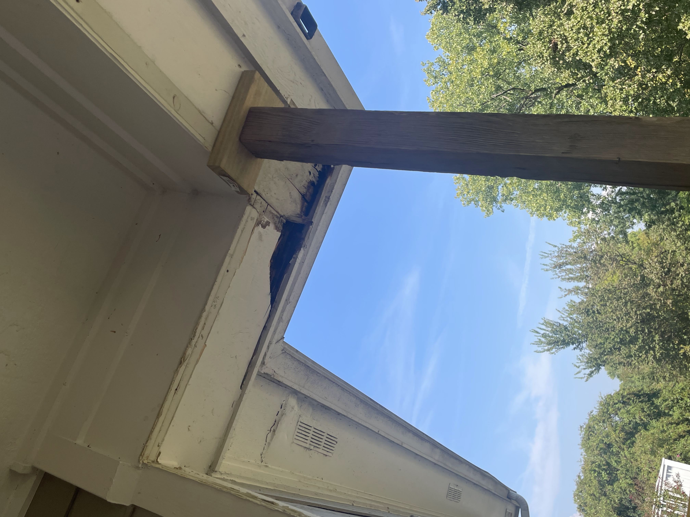
          <figcaption></figcaption>
       </figure>

       <figure style="width: 50%; text-align: center;">
          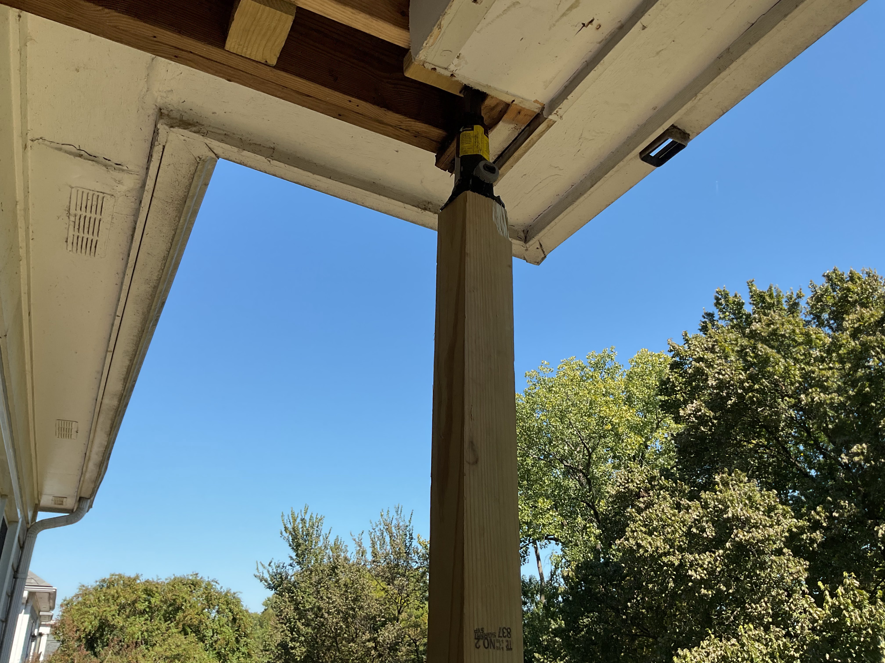
          <figcaption></figcaption>
       </figure>
    

1.  9/8/2025 - Floating deck foundational support beams. The support beam was not dig out deep enough to where over time the erosion removed enough sand/dirt to where the beam was no longer touching the ground

   <figure style="width: 50%; text-align: center;">
      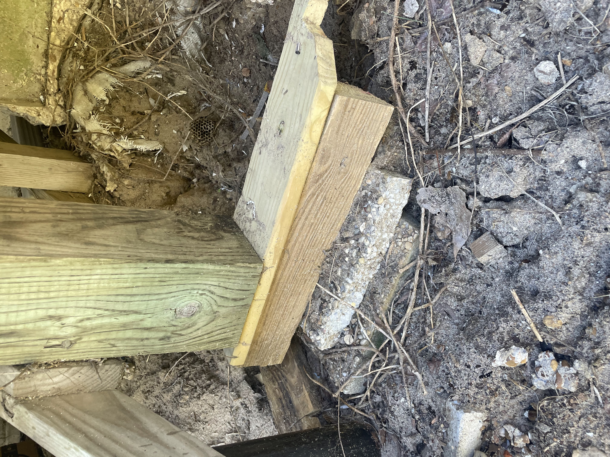
      <figcaption>
         There were other foundational support beams that had missing cement for a footer that have been fixed
      </figcaption>
   </figure>

1.  10/3/2025 - Had conversations with next door neighbors about how the previous owners "knew they needed to get to working on the deck" and "really want to get to the deck"
1.  Rotting on the beams in landing
1.  Stairs from landing to back yard
1.  Support beams for the balcony were sitting on top of the deck (did not go into the foundation) and were empty not up to code for supporting the balcony
    - Matt has since replaced those beams with structural schedule 40 that goes in the foundation past what is required for this area which brought the balcony back up to being level which was almost 3 inches
1.  Got the okay from my HOA that I did not need to submit an architectural request for the work being done
1.  Incorrectly poured footing on the stairs that lead to the backyard
    - The concrete was not poured all the way around the footer to where you could easily pull them out of the ground
1.  Missing handrail for the stairs to the backyard causing violations of shelby county code

## Foundation timeline

### All of the issues were missed by the home inspector and were not disclosed

1.  10/15/2025 Matt (contractor working on my deck remodel) noticed foundation issues

   <figure style="width: 50%; text-align: center;">
      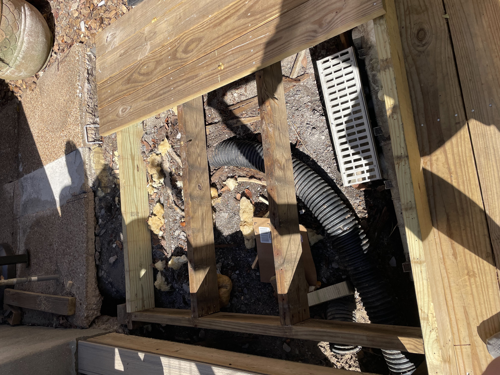
      <figcaption>
         Poly foam under landing by French drain that slopes toward the AC units and rotting beams under the wood.
      </figcaption>
   </figure>

   <figure style="width: 50%; text-align: center;">
      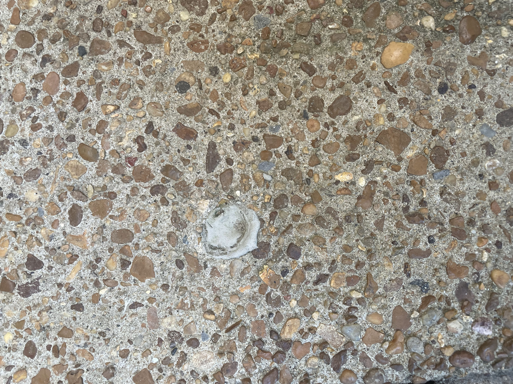
      <figcaption>
         Hole drilled into the walkway to pump poly fill under the sidewalk.
      </figcaption>
   </figure>

   <figure style="width: 50%; text-align: center;">
      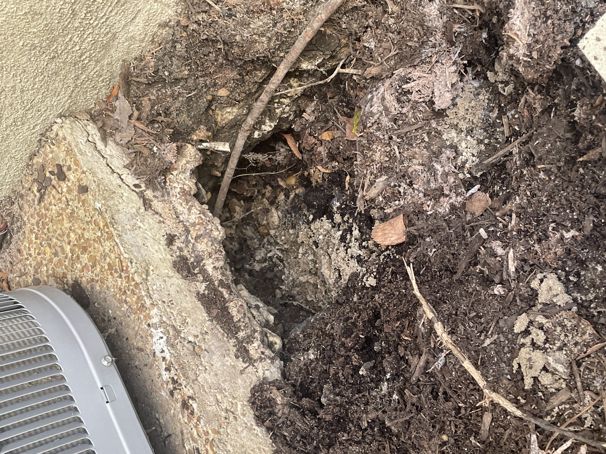
      <figcaption>
         Concrete was hollow under the AC units and contained a large hidden void filled with decorative rocks and covered with trash cans.
      </figcaption>
   </figure>

   <figure style="width: 50%; text-align: center;">
      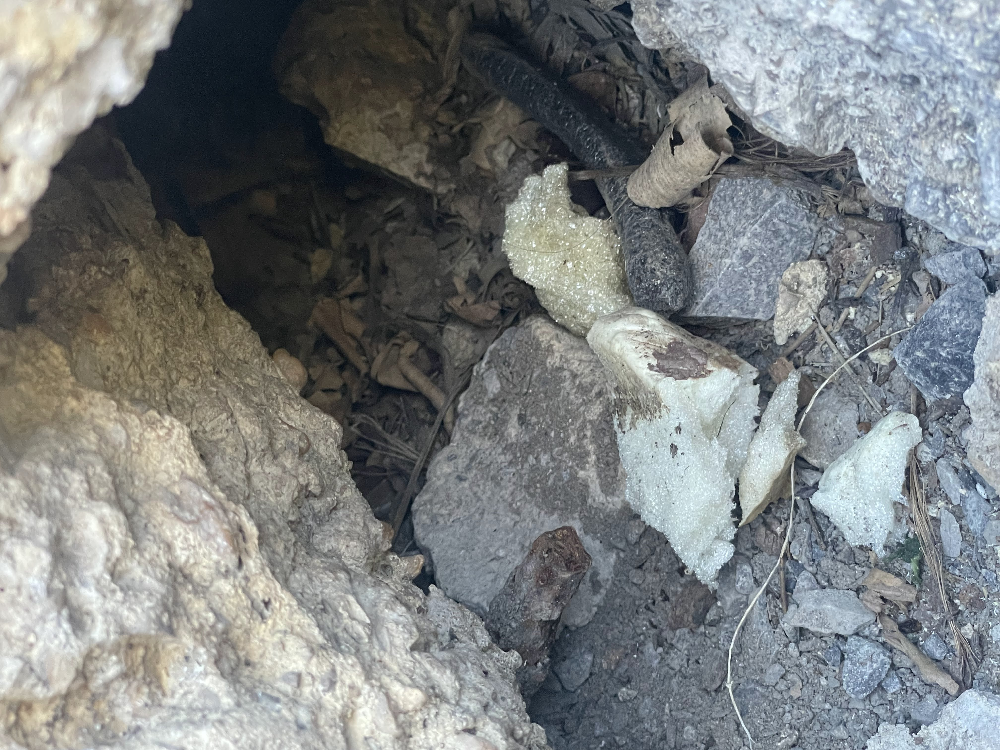
      <figcaption>
         Hole under the deck stairs/landing near the corner of the house with exposed rebar extending toward the AC-unit cavity. Clear signs of foundational fill sand erosion.
      </figcaption>
   </figure>

   <figure style="width: 50%; text-align: center;">
      
      <figcaption>
         Sandbags placed under the middle of the deck where additional erosion of foundation fill sand was visible.
      </figcaption>
   </figure>

   <figure style="width: 50%; text-align: center;">
      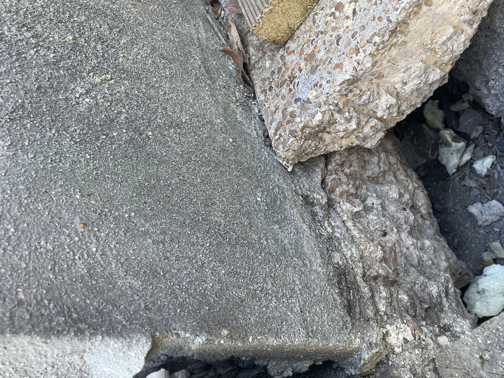
      <figcaption>
         Fresh skid installed to cover exposed foundation areas and conceal cracks or visible issues.
      </figcaption>
   </figure>

   <figure style="width: 50%; text-align: center;">
      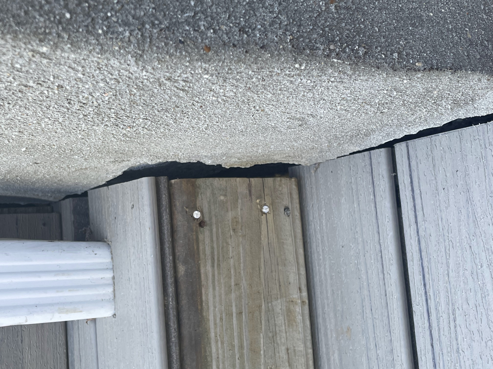
      <figcaption>
         Note: A clear sign this was used to hide foundation issues is that it was perfectly molded to the shape of the previous stairs.
      </figcaption>
   </figure>

1.  10/14/2025 - Neighbors mentioned previous owners had sidewalk cave in around the time of the house being put on the market
1.  11/20/2025 & 12/8/2025 - Emailed my HOA asking if there was past record of work done for where they repaved the conrete from being caved in, there was no records/disclourse
      

         <iframe src=".\pdfs\HOA.pdf" width="100%" height="600px" frameborder="0"></iframe>
      

1.  I noticed the downspout in the courtyard that is connected to the flower bed that is up against the whole under the AC unit was installed incorrectly where water from 1/3 of the house was gushing out of it and not only soakling the flower bed but stripping paint of the siding in that section only adding onto to more erosion in the hole. Matt noticed the current gutter guards that were installed by previous owners were allowing water to topple over it and not go down the drain during heavy rain.

    - 11/6/2025 - Matt fixed both of these issues by replacing all gutter guards and fixing the downspout to have the gutter properly connected to where water would not escape costing $600 for just the labor
      

         <figure style="width: 50%; text-align: center;">
            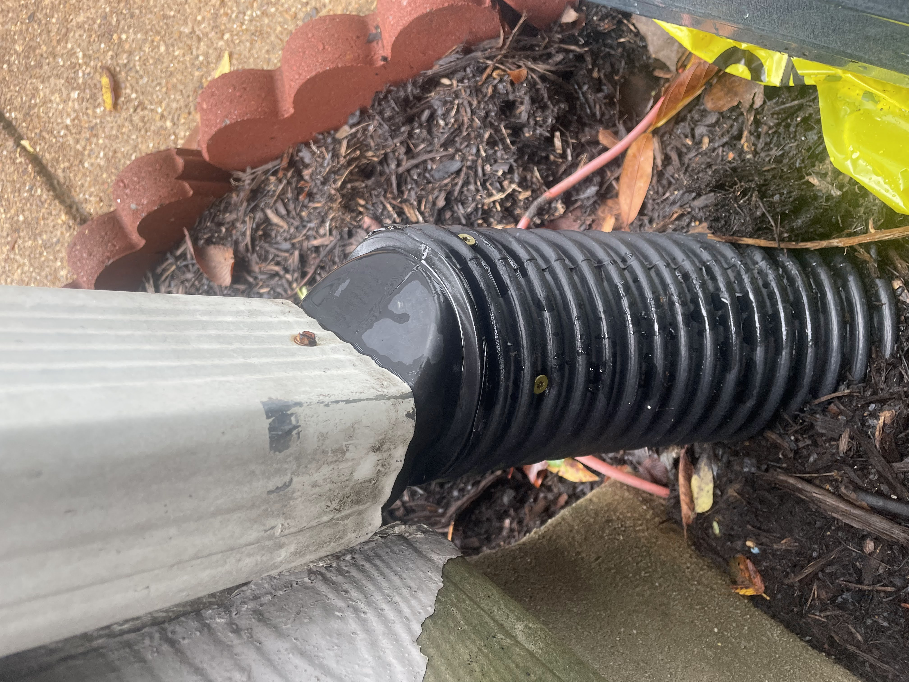
            <figcaption>
               Note: the gutter (white) should not be around the universal gutter (black)
            </figcaption>
         </figure>

         <figure style="width: 50%; text-align: center;">
            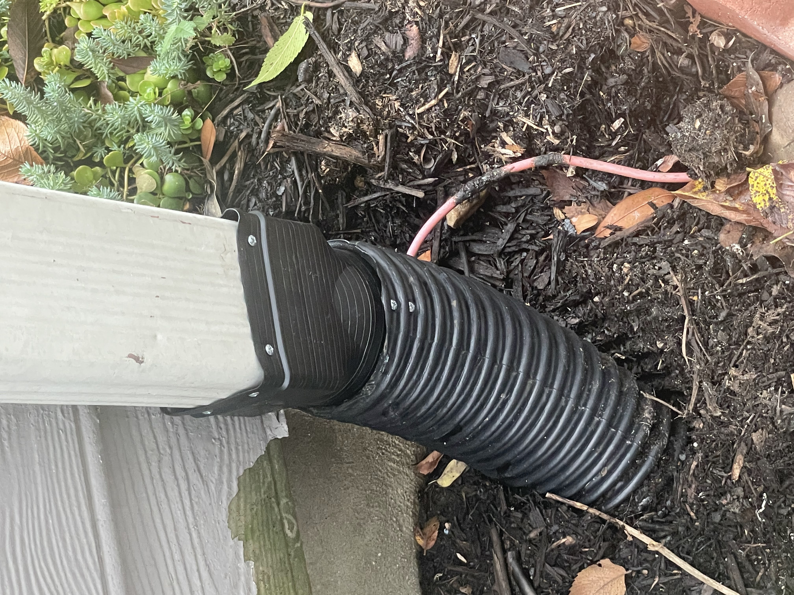
            <figcaption>
            Fix downspout: Contractor Matt fixed the downspout,
            </figcaption>
         </figure>
      

#### Getting quotes from foundation companies to diagnose issues we noticed

1.  Called DFX

    - Determined there was structural failure, said the failure was on the right side of the house (point of view of looking at the front of my house from the street).
    - Did not run any tests to give concrete evidence of how he came to the conclusion there was issues
    - Recommended push piers along the whole side of my house and putting in a drain and a pump by my AC units to ensure we remove water as fast as possible from that area
    
    

      <iframe src="./pdfs/foundation/dfx/Alex Cash_Updated DFX Agreement.pdf" width="100%" height="600px" frameborder="0"></iframe>
    

1.  10/28/2025 - Kermit B. Buck & Sons, INC.

    - Determined there was structural failure but was more focused on the hole under the AC unit. His main solution was seal the to spots under the deck where there is erosion. Then pump poly/flowable concrete into the hole until everything that was eroded was replaced and then monitor the first floor of the house for any issues getting worse than they already were

1.  10/30/2025 - Redeemers Group

    - Determined there was structural failure from the front to the back of the house, by using a laser level on the side of the house
    - Gave 3 recommendations on fixes, but overall recommended installing piers on a corner for better support
      

            <iframe src="./pdfs/foundation/redemers\Cash Redeemers Group, Inc. Proposal (Project 1, 10_30_25 1_09 pm).pdf" width="100%" height="600px" frameborder="0"></iframe>
            <iframe src="./pdfs/foundation/redemers/Cash Redeemers Group, Inc. Proposal (Project 2, 10_30_25 1_09 pm).pdf" width="100%" height="600px" frameborder="0"></iframe>
            <iframe src="./pdfs/foundation/redemers/Cash Redeemers Group, Inc. Proposal (Project 3, 10_30_25 1_09 pm).pdf" width="100%" height="600px" frameborder="0"></iframe>
      

1.  11/3/2025 - Olshan to come out for quotes
    - Olshan was the best plan for structural support across the whole house. Including external and internal pillars to ensure the area of influence of each pillar fixed my current issues and did not leave any gaps or areas where there could be future issues. The Olshan recommended plan putting 20 external pillars and 14 internal pillars costs $43,235.00 (not including cost to repair holes inside and rollup neighbors turf carpet to drill). I worked with them to create a modified plan to cover all the areas that are of high to medium priority that would include 13 external pillars and 6 internal pillars which costs $24,375.00 (not including cost to repair holes inside and rollup neighbors turf carpet to drill).
    - When Olshan came the guy (Tim) off the start told me he had been to this house before. He was the one who came and gave the quote and did the work on the sidewalk area that the previous owners had done. He was able to pull up the exact photos from his ipad when quoting and having the work done. Mentioned that he wanted to inspect inside the house but the owner did not let him and made him only stay outside and work on the sidewalk.
    - When Tim was inspecting the inside of the house for cracks, issues with the doors/windows, etc. He noted that there were clear signs of covering up cracks with fresh painting (past owners replaced all windows, floors, and repainted right before selling the house)/new trim work.
    - Tim noted there was areas all throughout the first floor of the house where the grade was as bad as 3 inches below level
    - He also pointed out that there were spots in the house where there was evidence of foundational issues that had been covered up due to painting and putting in fresh molding/trim around the house

#### Getting quotes from hardwood flooring companies

- Artisant flooring - They no longer do hardwood floors and recommended a few other companies
- Germantown Hardwood Floors
- 11/25/2025 Mid South Flooring
- Kings flooring

1. 12/9/2025 Olshan came out to the house and installed external pillings
1. 12/10/2025 Olshan came out and filled in the hole under my AC unit and Put concrete over the mulch bed that leads up to the AC unit

## House upgrades

| **Upgrade**                                                                                                  | **Year** | **Cost** |
| ------------------------------------------------------------------------------------------------------------ | -------- | -------- |
| Kitchen sink/faucet                                                                                          | 2025     |          |
| Kitchen handles                                                                                              | 2025     |          |
| Kitchen overhead light                                                                                       | 2025     |          |
| Overhead stairs light                                                                                        | 2025     |          |
| Add box for loose wire in attic                                                                              | 2025     |          |
| Outdoor flood light                                                                                          | 2025     |          |
| Courtyard/deck outdoor lights                                                                                | 2025     |          |
| Dining room overhead light                                                                                   | 2025     |          |
| Gutter guards                                                                                                | 2025     |          |
| Courtyard downspout                                                                                          | 2025     |          |
| Deck/balcony (fix rot, new railing, upgrade to Trex, new ceiling fan)                                        | 2025     |          |
| Ceiling fans (master, living room, deck)                                                                     | 2025     |          |
| Downstairs bathroom (paint vanity, new quartz sink, paint walls, towel holder, TP holder, hand towel holder) | 2025     |          |
| Water shut-offs (downstairs & guest bathrooms)                                                               | 2025     |          |
| External pillings on the foundation                                                                          | 2025     |          |
| Paint garage                                                                                                 | 2025     |          |
| 2× garage door opener                                                                                        | 2025     |          |
| Re-caulk/replace siding                                                                                      | 2025     |          |
| Replace light switches (downstairs hallway)                                                                  | 2025     |          |
| Caulking driveway control joints                                                                             | 2025     |          |
| Replace master bath shower head                                                                              | 2025     |          |
| Add missing GFCI in upstairs guest bathroom                                                                  | 2025     |          |
| Add missing GFCI in master bathroom                                                                          | 2025     |          |
| Add footrail to bar                                                                                          | 2025     |          |
| Re-caulk entire kitchen backsplash                                                                           | 2025     |          |

## House TODO

- Replace blinds at top of stairs
<!-- - Re-paint siding that has water damage
- Re-caulk siding where it is missing or damaged -->
- Repaint front door
- Replace light switches in living room
- Replace light switch and disposal switch in kitchen
- Fix and paint island
- Paint upstairs guest bathroom
- Install handtowel holder in upstairs guest bathroom
- Install towel hooks in upstairs guest bathroom
- Label fuse box
- Re-wire breakfast nook ceiling fan
- Fix the back gate + rig it up to always close if left open
- fix ceiling paint in masterbed room
