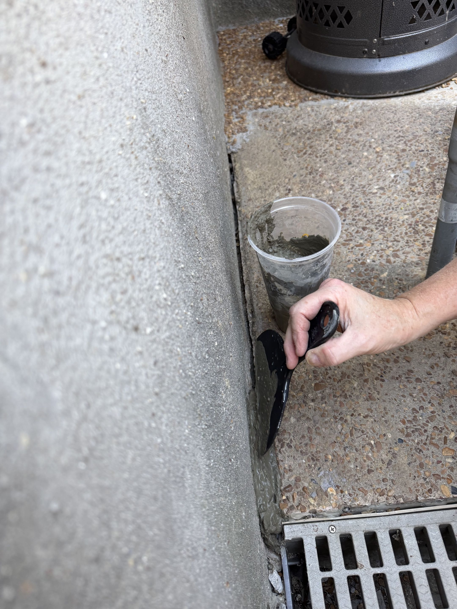
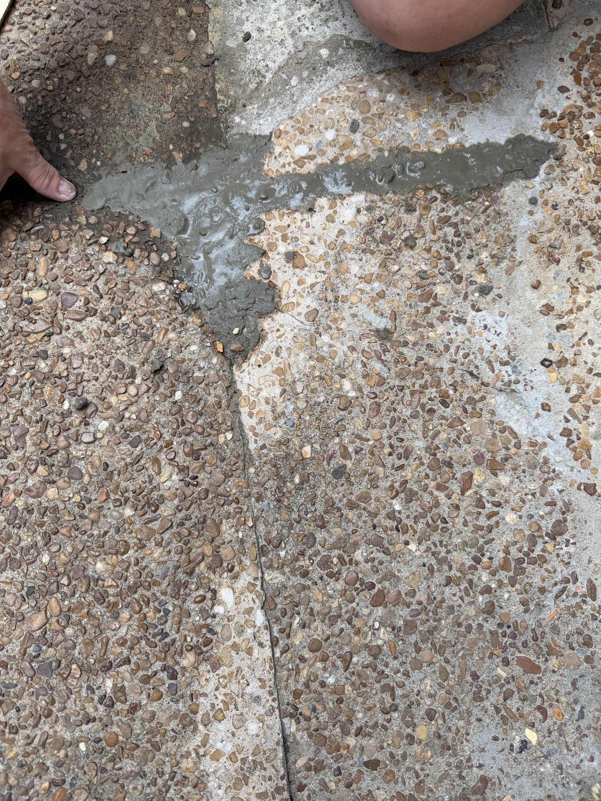

# [946 River Landing Drive — Non-Disclosure Case File](https://alcash55.github.io/House/)

**Property:** 946 River Landing Drive, Memphis, TN 38103 (Harbor Town)
**Buyers:** Alex Cash and Erika Wilt (under contract 7/25/2025)
**Prepared by:** Alex Cash — this document compiles the evidence, timeline, and damages for attorney review. Supporting PDFs and photographs are embedded throughout.

## Claim

The prior owners had knowledge of structural and foundational defects in the property. Evidence indicates they attempted minimal, temporary repairs intended to conceal these defects rather than properly address them. Despite this knowledge, the prior owners failed to disclose the existence of these structural or foundational issues prior to the sale of the property.

## Key Evidence Summary

1. **The prior owners hired Olshan Foundation Repair in 2021** to repair a sidewalk cave-in / sinkhole at the property (quoted 11/19/2021, work performed 12/2021). This is documented in Olshan's own records (PDF embedded below) and was confirmed in person by the same Olshan technician, Tim Hughes, who performed that work and later quoted our repairs. None of this appears on the seller disclosure forms.
2. **The prior owner refused to let Olshan inspect inside the house** during the 2021 work — per Tim Hughes, he was restricted to the exterior sidewalk area only.
3. **The seller disclosure forms contain no mention** of foundation or structural issues (PDFs embedded below).
4. **Physical concealment was found after purchase:** a large hidden void under the AC-unit slab filled with decorative rocks and covered with trash cans; a fresh concrete "skid" poured to cover exposed foundation areas, molded exactly to the shape of the previous stairs; poly-fill drill holes in the walkway; and — per Olshan's technician — fresh paint and new trim covering interior evidence of settlement.
5. **Neighbors independently confirmed knowledge:** the sidewalk caved in around the time the house was listed, and next-door neighbors recounted the prior owners saying they "knew they needed to get to working on the deck."
6. **The HOA has no record of the sidewalk repair** (HOA response embedded below) — the work was done privately and never surfaced in any disclosure.
7. **Erosion is a documented, neighborhood-wide problem:** the HOA's Wolf River Bank Erosion Project — addressing riverbank failures and sink holes, "years in the making" per the HOA President — extends up to this property's backyard, and residents at the time (including the prior owners) paid the HOA toward it (confirmed in conversations with neighbors, including a former HOA board member).
8. **The 2021 "repair" is still failing:** I have had to pour concrete twice in under 3 months (3/22/2026 and 6/7/2026) to patch cracks and gaps reopening in the same area.
9. **Four foundation companies found structural failure** (DFX, Kermit B. Buck & Sons, Redeemers Group, Olshan). Olshan's recommended full plan was $43,235; the modified plan was $24,375, with the exterior perimeter scope completed 12/8–10/2025. Two engineering reports from Ozer Structural Engineering are embedded below.

## Previous Owners

- Principal Global Engineering Manager, GREF Workplace Design & Construction @ Amazon — professional background in engineering, design, and construction

- Operating Advisor | Multi-Site Service Businesses

### Seller Disclosures

   

      <iframe src="./pdfs/disclosures/River Landing - PCD.pdf" width="100%" height="600px" frameborder="0"></iframe>
      <figcaption>
         Note: In section A, possible incorrect line items for:
            - Gas starter for fireplace
            - Whirlpool tub
      </figcaption>

      <iframe src="./pdfs/disclosures/River Landing - disclosure .pdf" width="100%" height="600px" frameborder="0"></iframe>

   

Neither disclosure document mentions the 2021 sidewalk cave-in, the Olshan repair, foundation settlement, deck/balcony rot, or erosion under the property.

## Evidence of Prior Knowledge and Concealment

### 2021 sidewalk cave-in and undisclosed Olshan repair

- Around the time the house was listed, the sidewalk at the property caved in (per neighbors, 10/14/2025 conversations).
- The prior owners hired Olshan Foundation Repair: quote given **11/19/2021**, work performed **12/2021**. Olshan's documentation of that work, provided to me by Tim Hughes on 12/5/2025:
   

      <iframe src="./pdfs/foundation/olshan/past/946 River Landing Drive , 20251205_Customer Proposal.pdf" width="100%" height="600px" frameborder="0"></iframe>
      <figcaption>
         Olshan's records of the prior owners' repair: quoted 11/19/2021, work performed 12/2021
      </figcaption>
   

- When Olshan technician Tim Hughes came to quote my repairs on 11/3/2025, he stated unprompted that **he had been to this house before** — he gave the quote and performed the 2021 sidewalk work for the prior owners, and pulled up the exact photos from that job on his iPad. He also stated that he wanted to inspect inside the house at that time, but **the owner did not let him inside** and restricted him to the exterior sidewalk work only.
- **11/20/2025 & 12/8/2025** — I emailed the HOA asking whether there was any record of the concrete repair where the sidewalk had caved in. The HOA had **no records** of the work:
      

         <iframe src="./pdfs/HOA.pdf" width="100%" height="600px" frameborder="0"></iframe>
      

### The repaired area is still failing (2026)

**3/22/2026 & 6/7/2026** — The area the prior owners had "fixed" by Olshan in 12/2021 continues to deteriorate. I have had to pour concrete twice in under 3 months to patch cracks and gaps reopening in this area:

   <figure style="width: 50%; text-align: center;">
      
      <figcaption>
         3/22/2026 — First pour: filling the gap that keeps opening along the foundation edge next to the French drain
      </figcaption>
   </figure>

   <figure style="width: 50%; text-align: center;">
      
      <figcaption>
         6/7/2026 — Second pour: fresh concrete in cracks/gaps reopening between the walkway slabs in the previously repaired area
      </figcaption>
   </figure>

### Wolf River Bank Erosion Project (HOA) — erosion is a known, local problem

Harbor Town has a documented, neighborhood-wide erosion problem along the Wolf River bank that the HOA has been working for years to address — including riverbank failures and **sink holes**. The erosion project area extends up to the backyard of this property.

Connecting the dots — while living here, the previous owners:

1. Had the sidewalk cave in with a sinkhole (repaired via Olshan 12/2021, never disclosed, no HOA record of the work), **and**
2. Had to pay the HOA — along with other residents at the time — toward this major Wolf River erosion project that runs up to their backyard. This has been confirmed in many conversations with neighbors, including one with a previous HOA board member.

Taken together these are related: the previous owners knew erosion in this exact area was severe enough that they were paying for a neighborhood remediation project reaching their own backyard, while the same mechanism (fill-sand washout, voids, sink holes) was actively occurring under their sidewalk and foundation — and none of it was disclosed. The 4/28/2026 and 7/9/2026 emails below in particular establish that these erosion issues are current and relevant to this specific area, not historical or speculative.

HOA emails (all from donotreply@cincsystems.net to Alex and Erika):

1.  **10/14/2025** — "Harbor Town 2026 Draft Budget": 2026 budget highlights note that Phase V paving was "**Put on hold due to erosion project**, will be accomplished in 2026" (draft budget PDF attached to the email)
1.  **12/12/2025** — "Harbor Town: Special Board Meeting": the President called a Special Meeting for 12/22/2025 "for the sole purpose of voting on **Harbor Erosion** and Phase 1 tree and concrete project" (the 12/22 special meeting minutes were attached to the 1/20/2026 board meeting email)
1.  **1/10/2026** — "A message from the President and Chair": the Board approved HDR's (contracted engineering firm) recommended contractor to begin work on the harbor erosion areas of the Wolf River: "The plan identifies numerous areas along the riverbank to **fix current failures**, reinforce potential future issues, and **address sink holes**. We are all anxious to begin work on this project that **has been years in the making**."
1.  **4/28/2026** — "A message from the President": Wolf River Harbor Erosion agreement signed with the contractor; start expected in 4–6 weeks; project duration 30–75 days: "I recognize this is a **long time coming**"
1.  **6/5/2026** — "A Message from the President": Harbor Erosion project on a two-week delay due to rain; targeting the week of June 22
1.  **7/9/2026** — "Ben's Park Closure & Wolf River Bank Erosion Project Beginning Monday": work on the Wolf River Bank Erosion Repair Project begins 7/13/2026; Ben's Park closed for the project

## Deck / Balcony Timeline

### None of these issues were disclosed by the previous owners

1.  **8/24/2025** — Noticed the main overhang from support post to support joist was sagging, and the deck overhang had damage that needed fixing
    

       <figure style="width: 100%; text-align: center;">
          
          <figcaption>
            Overhang damage. The home inspector noted this only after I pointed it out to him during the inspection.
          </figcaption>
       </figure>

       <figure style="width: 100%; text-align: center;">
          
          <figcaption>
            Sagging support joist. When contractor Matt went to fix it, he found the whole support was completely rotted.
          </figcaption>
       </figure>

       <figure style="width: 100%; text-align: center;">
          
          <figcaption>
            Rotted beam revealed during the repair.
          </figcaption>
       </figure>
    

1.  **8/24/2025** — A gusset that is part of the balcony frame was sagging, causing an extreme dip in the balcony floor
    

       
       <figcaption>Where the brown gaps are shown across each beam, the flooring should be connected to the beam but is not, due to rotting and sagging.</figcaption>
    

1.  **9/8/2025** — "Floating" deck foundation support beams: a support beam was not dug in deep enough, so over time erosion removed enough sand/dirt that the beam was no longer touching the ground

   <figure style="width: 50%; text-align: center;">
      
      <figcaption>
         Other foundation support beams were missing cement footers; these have since been fixed.
      </figcaption>
   </figure>

1.  **9/15/2025** — Site visit from Dmitry Ozeryansky of [Ozer Structural Engineering](https://www.ozer-eng.com/) to advise on supporting the balcony — additional rotted wood was found where the vertical support meets the underside of the roof — and to identify other areas needing to be brought up to code

   <figure style="width: 50%; text-align: center;">
      
   </figure>

1.  **9/17/2025** — Dmitry followed up by email with a video of his assessment and recommendations. Key items:
    - Adequate support of the roof and both levels of the deck
    - Protecting deck framing from rot and deterioration due to trapped water
    - Replacement of non-pressure-treated wood
    - Adequate support for handrail bases to provide capacity for a 200 lb outward load at the top of the handrail
    - Protecting the walls of the house from moisture intrusion resulting from the deck connections

1.  **9/18/2025** — Rot where the balcony support beam meets the roof
    

       <figure style="width: 50%; text-align: center;">
          
          <figcaption></figcaption>
       </figure>

       <figure style="width: 50%; text-align: center;">
          
          <figcaption></figcaption>
       </figure>
    

1.  **10/3/2025** — Conversations with next-door neighbors: the previous owners had said they "knew they needed to get to working on the deck" and "really want to get to the deck"

### Additional deck findings (documented during the remodel)

1.  Rotting on the beams in the landing
1.  Deteriorated stairs from the landing to the backyard
1.  The balcony support beams were sitting on top of the deck — they did not go into the foundation, were hollow, and were not up to code for supporting the balcony
    - Contractor Matt has since replaced those beams with structural Schedule 40 posts set into the foundation deeper than required for this area, which brought the balcony back up to level — it had been almost 3 inches off
1.  Incorrectly poured footings on the stairs leading to the backyard — the concrete was not poured all the way around the footers, so they could easily be pulled out of the ground
1.  Missing handrail on the stairs to the backyard — a violation of Shelby County code
1.  HOA confirmed no architectural request was needed for the repair work being done

## Foundation Timeline

### All of these issues were missed by the home inspector and were not disclosed

1.  **10/15/2025** — Matt (contractor working on the deck remodel) noticed foundation issues

   <figure style="width: 50%; text-align: center;">
      
      <figcaption>
         Poly foam under the landing by the French drain that slopes toward the AC units, and rotting beams under the wood.
      </figcaption>
   </figure>

   <figure style="width: 50%; text-align: center;">
      
      <figcaption>
         Hole drilled into the walkway to pump poly fill under the sidewalk.
      </figcaption>
   </figure>

   <figure style="width: 50%; text-align: center;">
      
      <figcaption>
         The concrete was hollow under the AC units and contained a large hidden void — filled with decorative rocks and covered with trash cans.
      </figcaption>
   </figure>

   <figure style="width: 50%; text-align: center;">
      
      <figcaption>
         Hole under the deck stairs/landing near the corner of the house, with exposed rebar extending toward the AC-unit cavity. Clear signs of foundation fill-sand erosion.
      </figcaption>
   </figure>

   <figure style="width: 50%; text-align: center;">
      
      <figcaption>
         Sandbags placed under the middle of the deck where additional erosion of foundation fill sand was visible.
      </figcaption>
   </figure>

   <figure style="width: 50%; text-align: center;">
      
      <figcaption>
         Fresh concrete "skid" installed to cover exposed foundation areas and conceal cracks or visible issues.
      </figcaption>
   </figure>

   <figure style="width: 50%; text-align: center;">
      
      <figcaption>
         A clear sign this was poured to hide foundation issues: it was molded exactly to the shape of the previous stairs.
      </figcaption>
   </figure>

1.  **10/14/2025** — Neighbors mentioned the previous owners had the sidewalk cave in around the time the house was put on the market
1.  **11/20/2025 & 12/8/2025** — Emailed the HOA asking for records of the concrete repair where the sidewalk had caved in — no records or disclosure existed (see PDF in "Evidence of Prior Knowledge" above)
1.  The courtyard downspout — connected to the flower bed that sits against the void under the AC unit — was installed incorrectly: water from roughly 1/3 of the house gushed out of it, soaking the flower bed, stripping paint off the siding in that section, and adding to the erosion in the hole. Matt also found that the gutter guards installed by the previous owners let water topple over rather than drain during heavy rain.
    - **11/6/2025** — Matt fixed both issues, replacing all gutter guards and properly connecting the downspout/gutter so water could not escape — $600 in labor alone
      

         <figure style="width: 50%; text-align: center;">
            
            <figcaption>
               The gutter (white) should not be around the universal gutter (black).
            </figcaption>
         </figure>

         <figure style="width: 50%; text-align: center;">
            
            <figcaption>
               The downspout after Matt's repair.
            </figcaption>
         </figure>
      

## Professional Foundation Assessments

### Foundation company quotes to diagnose the issues

1.  **10/23/2025 — DFX**
    - Determined there was structural failure on the right side of the house (viewed from the street)
    - Did not run tests to provide concrete evidence for how he reached that conclusion
    - Recommended push piers along the whole side of the house, plus a drain and pump by the AC units to remove water from that area as fast as possible

    

      <iframe src="./pdfs/foundation/dfx/Alex Cash_Updated DFX Agreement.pdf" width="100%" height="600px" frameborder="0"></iframe>
    

1.  **10/28/2025 — Kermit B. Buck & Sons, Inc.**
    - Determined there was structural failure, focused on the hole under the AC unit. Main solution: seal the two spots under the deck where there is erosion, pump poly/flowable concrete into the hole until everything eroded was replaced, then monitor the first floor of the house for worsening issues

1.  **10/30/2025 — Redeemers Group**
    - Determined there was structural failure from the front to the back of the house, using a laser level on the side of the house
    - Gave 3 repair options; overall recommended installing piers at a corner for better support
      

            <iframe src="./pdfs/foundation/redemers/Cash Redeemers Group, Inc. Proposal (Project 1, 10_30_25 1_09 pm).pdf" width="100%" height="600px" frameborder="0"></iframe>
            <iframe src="./pdfs/foundation/redemers/Cash Redeemers Group, Inc. Proposal (Project 2, 10_30_25 1_09 pm).pdf" width="100%" height="600px" frameborder="0"></iframe>
            <iframe src="./pdfs/foundation/redemers/Cash Redeemers Group, Inc. Proposal (Project 3, 10_30_25 1_09 pm).pdf" width="100%" height="600px" frameborder="0"></iframe>
      

1.  **11/3/2025 — Olshan Foundation Repair**
    - Olshan had the best plan for structural support across the whole house, using external and internal pilings so each piling's area of influence fixed the current issues without leaving gaps for future problems. Olshan's recommended plan — 20 external and 14 internal pilings — was **$43,235.00** (not including the cost to repair interior drill holes or roll up the neighbor's turf carpet to drill). I worked with them on a modified plan covering all high- and medium-priority areas — 13 external and 6 internal pilings — for **$24,375.00** (same exclusions).
      

         <iframe src="./pdfs/foundation/olshan/Alex Cash, 946 River Landing Drive, 20251103_Customer Proposal.pdf" width="100%" height="600px" frameborder="0"></iframe>
      

    - **Technician Tim Hughes told me at the start of the visit that he had been to this house before** — he gave the quote and did the 2021 sidewalk work for the previous owners, and pulled up the exact photos from that job on his iPad. He said he had wanted to inspect inside the house at the time, but the owner did not let him and made him stay outside to work on the sidewalk only.
    - While inspecting inside the house for cracks and door/window issues, Tim noted **clear signs of cracks being covered with fresh paint and new trim work** (the past owners replaced all windows and floors, and repainted, right before selling the house)
    - Tim noted areas throughout the first floor where the grade was as much as **3 inches below level**
    - He also pointed out spots in the house where evidence of foundation issues had been covered up by painting and installing fresh molding/trim
    - **12/5/2025** — Tim Hughes (thughes@olshanfoundation.com) sent an "Exterior only" proposal, scoped to exterior perimeter work only
      

         <iframe src="./pdfs/foundation/olshan/Alex Cash, 946 River Landing Drive, 20251205_Customer Proposal.pdf" width="100%" height="600px" frameborder="0"></iframe>
      

    - **12/5/2025** — Tim Hughes also sent Olshan's documentation of the prior owners' work (quote 11/19/2021, work performed 12/2021 — embedded in "Evidence of Prior Knowledge" above)

### Foundation work completed

1. **12/9/2025** — Olshan installed external pilings (exterior perimeter scope of the modified repair plan, completed 12/8–10/2025)
1. **12/10/2025** — Olshan filled in the hole under the AC unit and poured concrete over the mulch bed leading up to the AC unit to prevent further washout and erosion
1. **2/11/2026** — Received Olshan warranty documents from Gia Fox (Admin, Olshan Foundation Repair and Waterproofing)
   

      <iframe src="./pdfs/foundation/olshan/warranty/946 river landing dr.pdf" width="100%" height="600px" frameborder="0"></iframe>
   

1. **3/20/2026** — Olshan return visit (appointment set by care@olshanfoundation.com)
1. **4/21/2026** — Tim Hughes (Certified Structural Technician / Polyurethane Specialist) sent an updated estimate
   

      <iframe src="./pdfs/foundation/olshan/Alex Cash, 946 River Landing Drive, 20260421_Customer Proposal.pdf" width="100%" height="600px" frameborder="0"></iframe>
   

### Ozer Structural Engineering — independent foundation assessment

1. **5/25/2026** — Paid Ozer Engineering **$550** (Invoice #3129) for a foundation assessment; site visit conducted 5/26/2026
1. **6/3/2026** — Ozer (Gerardo Mendez) requested copies of all previous settlement reports to compare with site-visit findings. Sent them both Olshan proposals (11/3/2025 original and 4/21/2026 updated)
1. **6/10/2026** — Ozer asked which push piers had been installed and their installation dates
   - Clarified that Olshan installed **pilings, NOT push piers**
   - All exterior perimeter work in the "MODIFIED REPAIR PLAN" was completed December 8–10, 2025
   - The only change in the updated plan vs. the original was one extra piling added to the bottom-right section
1. **6/19/2026** — Ozer delivered the initial foundation report
   

      <iframe src="./pdfs/ozer/946 River Landing DR report (initial).pdf" width="100%" height="600px" frameborder="0"></iframe>
   

1. **6/22/2026** — Ozer raised several concerns in a follow-up email:
   - They were not aware of a potential legal dispute; stated they would have priced the assessment differently or turned it away had they known
   - Stated the house does not appear to have experienced significant movement during my ownership
   - Stated that settlement alone does not constitute a foundation failure
   - Stated conditions observed during inspection did not indicate a structural safety concern
1. **6/23/2026** — I responded formally, pushing back and requesting a revised report:
   - Clarified Olshan's two separate periods of work on this property: December 2021 (sidewalk repair for the prior owners only) and December 9–10, 2025 (foundation work I commissioned)
   - Clarified the potential legal dispute is against the **prior owners for non-disclosure**, not against any contractor or engineering firm
   - Called out that the initial report used vague language ("if you decide to address the cosmetic or functional concerns") with no consequences defined and no clear classification of conditions
   - Noted that the employees on site 5/26 explicitly promised strong recommendations and clear next steps, which were not reflected in the report
   - Asked specifically: Is there a foundation failure (yes or no)? Where are the most critical problem areas? What causes the differential settlement in the rear? What are the consequences of not acting?
   - Asked why Ozer's elevation measurements do not match Olshan's measurements
   - Formally requested a new or updated report addressing all of these points
1. **6/26/2026** — Ozer acknowledged the feedback and agreed to revise the report, promising delivery the following week
1. **6/30/2026** — Ozer delivered the updated foundation report. They explained the elevation measurement discrepancy: Ozer set one location as **0.0 inches** as their benchmark and measured all other elevations relative to that point; Olshan used a different reference point, which is why the numerical values differ even though the overall floor profile and settlement areas are similar
   

      <iframe src="./pdfs/ozer/946 River Landing DR report (updated).pdf" width="100%" height="600px" frameborder="0"></iframe>
   

## Damages

### Lease break (direct damages from the purchase)

Prior to purchasing 946 River Landing Drive, Alex and Erika were tenants at **138 Harbor Village Dr., Apt #201, Memphis, TN 38103** (Arbors Harbor Town, managed by Fogelman Properties). Purchasing the home — which concealed undisclosed structural and foundation defects — required breaking that lease early.

**Arbors Harbor Town contacts:**

- Shelby Douglas — Business Manager | shelby@arborsharbortown.com | 901-526-0322
- Chris Hawkins — Leasing Consultant | chris@arborsharbortown.com

Lease break timeline:

- **7/25/2025** — Alex called Shelby Douglas to give official notice of the lease break due to being under contract on 946 River Landing Drive. Followed up by email confirming the notice and raising pre-existing maintenance requests in the portal (requesting they not be counted against us). Email from alex.e.cash28@gmail.com to shelby@arborsharbortown.com, cc'd erikawilt3@gmail.com.
- **7/25/2025** — Follow-up email confirming the unit address: 138 Harbor Village Dr. Apt #201.
- **7/25/2025** — Shelby acknowledged receipt; confirmed Chris Hawkins would send Notice to Vacate (NTV) paperwork with applicable fees.
- **7/29/2025** — Shelby forwarded the request internally to send NTV forms.
- **7/30/2025** — Chris Hawkins sent the NTV documents by email with two PDF attachments:
  - `Office Copy NTV Wilt, Cash.pdf` — to be signed and returned
  - `Verification of Notice to Vacate Wilt, Cash.pdf` — tenant copy for records

   <iframe src="./pdfs/arborsHarbor/Office Copy NTV Wilt, Cash.pdf" width="100%" height="600px" frameborder="0"></iframe>

- **7/31/2025** — Alex returned the signed NTV (`Office Copy NTV Wilt, Cash SIgned.pdf`) to Shelby.

   <iframe src="./pdfs/arborsHarbor/Verification of Notice to Vacate Wilt, Cash.pdf" width="100%" height="600px" frameborder="0"></iframe>

- **7/31/2025** — Shelby confirmed receipt of the signed NTV.
- **9/24/2025** — Abby from Arbors Harbor Town notified us the final utility bill was posted; balance owed: **$4,182.34**. Stated the security deposit refund would be submitted once paid.

| Item                               | Amount        |
| ---------------------------------- | ------------- |
| Payment 8/2/2025 (final rent/fees) | $2,174.50     |
| Final utility bill paid 9/24/2025  | $4,182.34     |
| **Total paid to break lease**      | **$6,356.84** |

### Remediation costs to date (summary)

| Item | Date | Amount |
| --- | --- | --- |
| Lease break (total paid) | 8/2/2025 & 9/24/2025 | $6,356.84 |
| Gutter guard replacement + downspout repair (Matt, labor only) | 11/6/2025 | $600.00 |
| Olshan foundation repair — modified plan quote $24,375.00; exterior perimeter scope performed 12/8–10/2025 (see proposals/warranty above for contracted amounts) | 12/2025 | see Olshan documents |
| Ozer Structural Engineering foundation assessment (Invoice #3129) | 5/25/2026 | $550.00 |
| Deck/balcony structural remediation (contractor Matt — rot, supports, code items) | 2025–2026 | invoices to be compiled |
| Hardwood floor repair (needed due to settlement) | quotes below | not yet incurred |
| Sidewalk re-patching materials (two pours) | 3/22/2026 & 6/7/2026 | minor (materials) |

### Hardwood flooring quotes (future repair costs from settlement)

- Artisan Flooring — no longer does hardwood floors (although they were Olshan's recommendation)
- Germantown Hardwood Floors
   <iframe src="./pdfs/flooring/germantownhardwoodfloorsinc.pdf" width="100%" height="600px" frameborder="0"></iframe>
- **11/25/2025** — Mid South Flooring
    <iframe src="./pdfs/flooring/Mid_South_Flooring_LLC.pdf" width="100%" height="600px" frameborder="0"></iframe>
- Kings Flooring — never got back to me
- Erick's Flooring
    <iframe src="./pdfs/flooring/Ericks Flooring estimate 467.pdf" width="100%" height="600px" frameborder="0"></iframe>
- Old World Floors — recommended by an Artisan employee

## House Upgrades (owner investment in the property since purchase)

| **Upgrade**                                                                                                      | **Year** | **Cost** | **Date** | **Item(s)** |
| ---------------------------------------------------------------------------------------------------------------- | -------- | -------- | -------- | ----------- |
| Kitchen sink/faucet                                                                                              | 2025     |          |          |             |
| Kitchen handles                                                                                                  | 2025     |          |          |             |
| Kitchen overhead light                                                                                           | 2025     |          |          |             |
| Overhead stairs light                                                                                            | 2025     |          |          |             |
| Add box for loose wire in attic                                                                                  | 2025     |          |          |             |
| Outdoor flood light                                                                                              | 2025     |          |          |             |
| Replace courtyard/deck outdoor lights                                                                            | 2025     |          |          |             |
| Dining room overhead light                                                                                       | 2025     |          |          |             |
| Gutter guards                                                                                                    | 2025     |          |          |             |
| Courtyard downspout                                                                                              | 2025     |          |          |             |
| Deck/balcony (fix rot, new railing, upgrade to Trex, new ceiling fan)                                            | 2025     | $1,952.15 (cable railing hardware only) | Sep 4 & Oct 5, 2025 | [Muzata 15–20FT level railing kit](https://www.amazon.com/dp/B0CWP5D8Y9), [corner post](https://www.amazon.com/dp/B08X442X84), [5–10FT side-mount stair kit](https://www.amazon.com/dp/B0DPLV94ZL), [stair post](https://www.amazon.com/dp/B08K8RM74L), [level post](https://www.amazon.com/dp/B083NG9LK4), [5–10FT stair post kit](https://www.amazon.com/dp/B0CMSXR9LD) |
| Ceiling fans (master, living room, deck)                                                                         | 2025     |          |          |             |
| Downstairs bathroom (paint vanity, new quartz sink, paint walls, towel holder, TP holder, hand towel holder, mirror) | 2025 | $392.45  | Aug 22–23, 2025 | [EQLOO 30" quartz vanity top, undermount sink](https://www.amazon.com/dp/B0CX83ZXZ2) $323.32, [Minuover black-framed mirror](https://www.amazon.com/dp/B09N6KPX2Z) $69.13 |
| Water shut-offs (downstairs & guest bathrooms)                                                                   | 2025     |          |          |             |
| External pilings on the foundation                                                                               | 2025     |          |          |             |
| Paint garage                                                                                                     | 2025     |          |          |             |
| 2× garage door opener                                                                                            | 2025     |          |          |             |
| Re-caulk/replace siding                                                                                          | 2025     |          |          |             |
| Replace light switches (downstairs hallway)                                                                      | 2025     |          |          |             |
| Caulk driveway control joints                                                                                    | 2025     |          |          |             |
| Replace master bath shower head                                                                                  | 2025     |          |          |             |
| Add missing GFCI in upstairs guest bathroom                                                                      | 2025     |          |          |             |
| Add missing GFCI in master bathroom                                                                              | 2025     |          |          |             |
| Add footrail to bar                                                                                              | 2025     | $49.93   | Sep 10, 2025 | [Willstar 6FT pipe foot rail](https://www.amazon.com/dp/B08YF4YZC9) |
| Re-caulk entire kitchen backsplash                                                                               | 2025     |          |          |             |
| Caulk granite countertop slab right of oven (was never caulked; would pop up if weight was applied)              | 2025     |          |          |             |
| Label fuse box                                                                                                   | 2025     |          |          |             |
| Fix chimney flashing                                                                                             | 2025     |          |          |             |
| Replace gutter on the back deck                                                                                  | 2025     |          |          |             |
| Fix/replace rotted wood that holds up the back gate                                                              | 2025     |          |          |             |
| Fix dryer lint connection to the wall (was never connected to the exhaust; lint was going into the wall)         | 2025     |          |          |             |
| Replace kitchen, dining room, stairway, and upstairs hallway switches and faceplates                             | 2026     |          |          |             |
| Replace all door hinges to be consistent color, shape, and size (incl. hinge-pin door stoppers & ball catch)     | 2026     | $318.01 (13 orders) | Jan 3 – Mar 14, 2026 | [48-pack 3.5" matte black hinges](https://www.amazon.com/dp/B095YX38VH) $51.99, [AmzGod 42-pack 3.5"](https://www.amazon.com/dp/B0C8JD533R) $54.86, [goldenwarm 4" 6-pack](https://www.amazon.com/dp/B0DSGW7VFL) $27.43, [goldenwarm 4" 3-pack](https://www.amazon.com/dp/B09PY8N4VM) ×3, [3-pack 3.5"](https://www.amazon.com/dp/B095YM2VL8) ×3, [#10×1½" SS wood screws](https://www.amazon.com/dp/B0CPV69D4V) ×3, [hinge-pin door stoppers 4-pack](https://www.amazon.com/dp/B09DS74R64) ×2 $21.92, [QCAA brass double ball catch](https://www.amazon.com/dp/B0834166WP) $43.86 |
| Replace ceiling fan in office                                                                                    | 2026     |          |          |             |
| Replace ceiling fan in breakfast nook                                                                            | 2026     |          |          |             |
| Fix/fill hole with insulation that was left open under generator hookup in office closet                         | 2026     |          |          |             |
| Replace all interior door handles                                                                                | 2026     | $600.69  | Jun 2 – Jun 21, 2026 | [Schlage F170 dummy lever RH](https://www.amazon.com/dp/B001A5O6I6) + [LH](https://www.amazon.com/dp/B002DEM4CS) $360.35, [Schlage F10 passage lever](https://www.amazon.com/dp/B001A5O6EA) ×4 $117.42, [Schlage F40 privacy lever](https://www.amazon.com/dp/B001A5O6F4) $122.92 |
| Replace front door hardware — smart deadbolt + entry handleset (in progress)                                     | 2026     | $402.84  | Jul 8, 2026 | [Yale Assure Lock 2 deadbolt](https://www.amazon.com/dp/B0B9HWYMV5), [Schlage FE285 handleset](https://www.amazon.com/dp/B00Z3JDLEU) |
| Fix deck landing (removed rotted boards and footing)                                                             | 2026     |          |          |             |
| Seal and paint the deck supports                                                                                 | 2026     |          |          |             |
| Fix and paint island/kitchen                                                                                     | 2026     |          |          |             |
| Replace light switches and faceplates by front door and in the understairs closet                                | 2026     |          |          |             |
| Paint wood frame around the deck ceiling                                                                         | 2026     |          |          |             |
| Remove paint that was on stairs and caulk both sides                                                             | 2026     |          |          |             |
| Install Blink security cameras                                                                                   | 2026     |          |          |             |
| Install Blink doorbell                                                                                           | 2026     |          |          |             |
| Finish railing on the deck                                                                                       | 2026     |          |          |             |

_Costs/dates/links pulled from Amazon order history (7/10/2026). Amazon order totals include tax, except items pulled out of mixed orders (Mar 3 hinge items, Jun 2 Schlage F10 ×2), which are pre-tax item prices. A duplicate 48-pack of hinges (Jan 24, 2026, $51.99) was returned/refunded and is excluded. Blank costs were purchased elsewhere — to be backfilled from other retailers._

## Appendix

### House TODO (owner notes, not case-related)

- Replace all blinds
- Touch up paint on front door
- Replace light switches in living room and upstairs
- Replace light switch and disposal switch in kitchen
- Paint upstairs guest bathroom
- Install hand-towel holder in upstairs guest bathroom
- Install towel hooks in upstairs guest bathroom
- Rig the back gate to always close if left open
- Fix ceiling paint in master bedroom
- Fix rotting wood on both sides of the front door
- Deck stairs
- Deck lattice frame
