# [House stuff](https://alcash55.github.io/House/)

## Deck timeline

## Claim

The prior owners had knowledge of structural and foundational defects in the property. Evidence indicates they attempted minimal temporary repairs intended to conceal these defects rather than properly address them. Despite this knowledge, the prior owners failed to disclose the existence of these structural or foundational issues prior to the sale of the property.

## Apartment

## Previous Owners

- Principal Global Engineering Manager, GREF Workplace Design & Construction @ Amazon

- Operating Advisor | Multi-Site Service Buinesses

### Disclosures

   

      <iframe src="./pdfs/disclosures/River Landing - PCD.pdf" width="100%" height="600px" frameborder="0"></iframe>
      <figcaption>
         Note: In section A, possible incorrect line items for:
            - Gas starter for fireplace
            - Whirlpool tub 
      </figcaption>

      <iframe src="./pdfs/disclosures/River Landing - disclosure .pdf" width="100%" height="600px" frameborder="0"></iframe>

   

### All of these issues were not disclosed by previous owners

1.  8/24/2025 - Noticed main overhang from support post to support joist was sagging, and deck overhang had damages that needed fixing
    

       <figure style="width: 100%; text-align: center;">
          
          <figcaption>
            Overhang damages: Inspector noted this only after I pointed it out to him during the inspection   
          </figcaption>
       </figure>

       <figure style="width: 100%; text-align: center;">
          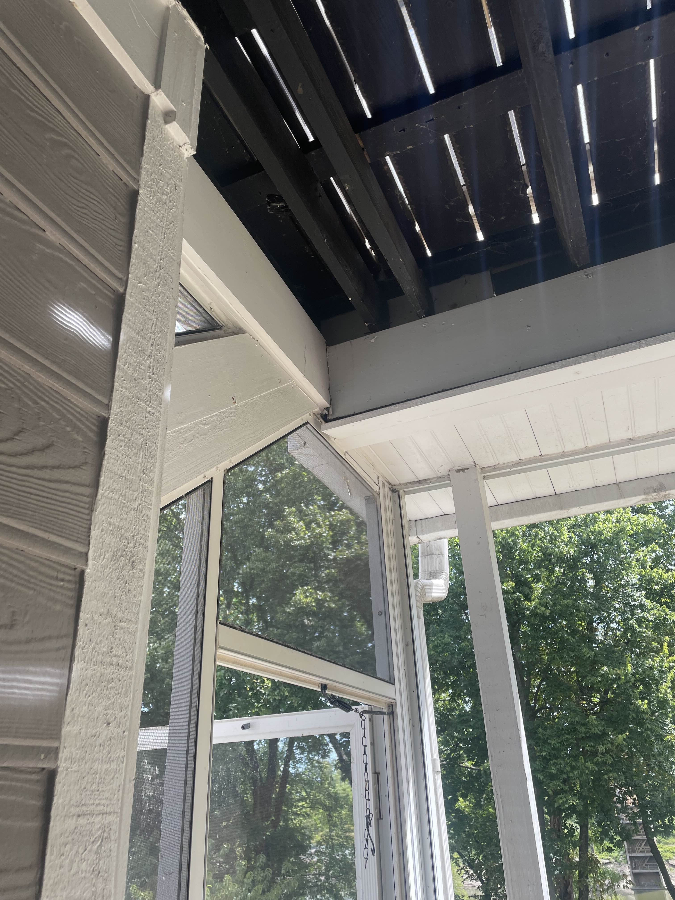
          <figcaption>
            Support Joist Sagging: Contractor Matt went to fix it and revealed the whole support was completely rotted
          </figcaption>
       </figure>

       <figure style="width: 100%; text-align: center;">
          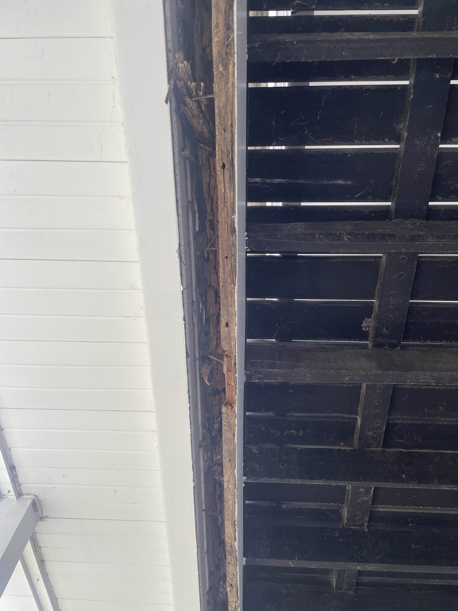
          <figcaption>
            Rotting Beam: Contractor Matt went to fix it and revealed the whole support was completely rotted
          </figcaption>
       </figure>
    

1.  8/24/2025 - Gusset that is apart of the balcony frame sagging causing extreme dip on the balcony floor
    

       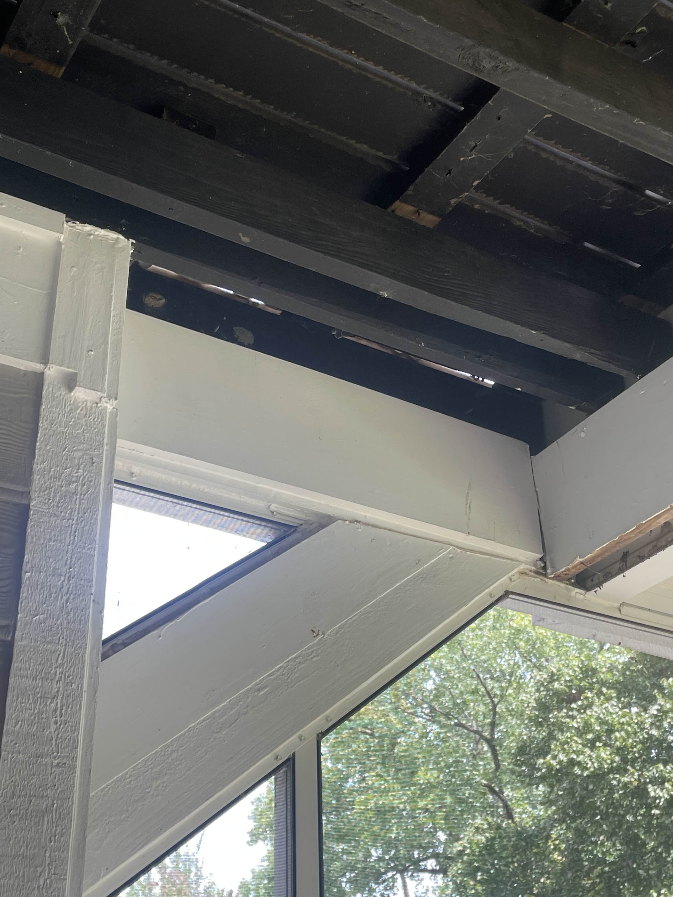
       <figcaption>Note: where the brown gaps are shown, goes across each beam where the flooring should be connected to the beam but is not due to rotting and sagging</figcaption>
    

1.  9/8/2025 - Floating deck foundational support beams. The support beam was not dig out deep enough to where over time the erosion removed enough sand/dirt to where the beam was no longer touching the ground

   <figure style="width: 50%; text-align: center;">
      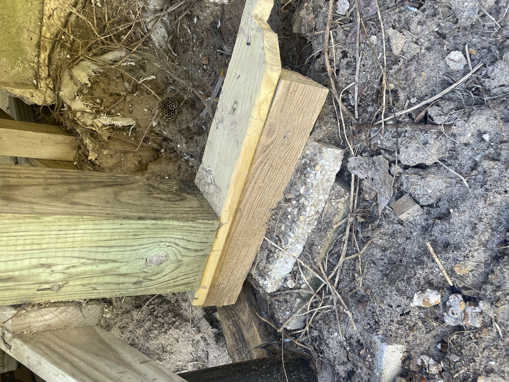
      <figcaption>
         There were other foundational support beams that had missing cement for a footer that have been fixed
      </figcaption>
   </figure>

1.  9/15/2025 - Had Dmitry Ozeryansky from [Ozer Structural Engineering](https://www.ozer-eng.com/) come to the house to give a quote on how to support the balcony since there was more rotted wood that was found where the vertical support meets the underside of the roof and to give any other insight of areas that need to follow code

   <figure style="width: 50%; text-align: center;">
      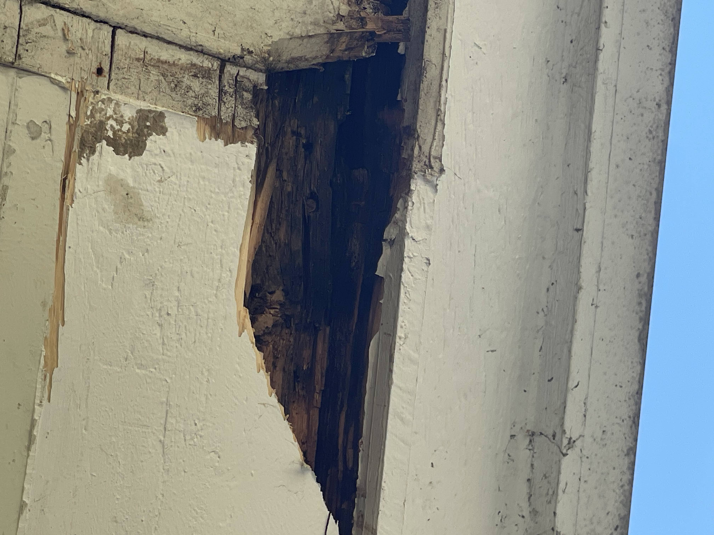
   </figure>

1.  9/17/2025 - Dmitry followed up via email after the site visit with a video of his assessment and recommendations. Key items covered:
    - Adequate support of the roof and both levels of deck
    - Protecting deck framing from rot and deterioration due to trapped water
    - Replacement of non-pressure treated wood
    - Adequate support for handrail bases to provide capacity for 200 lb load outward at the top of the handrail
    - Protecting the walls of the house from moisture intrusion resulting from the deck connections

1.  9/18/2025 - Rotting where the support beam on the balcony meets the roof
    

       <figure style="width: 50%; text-align: center;">
          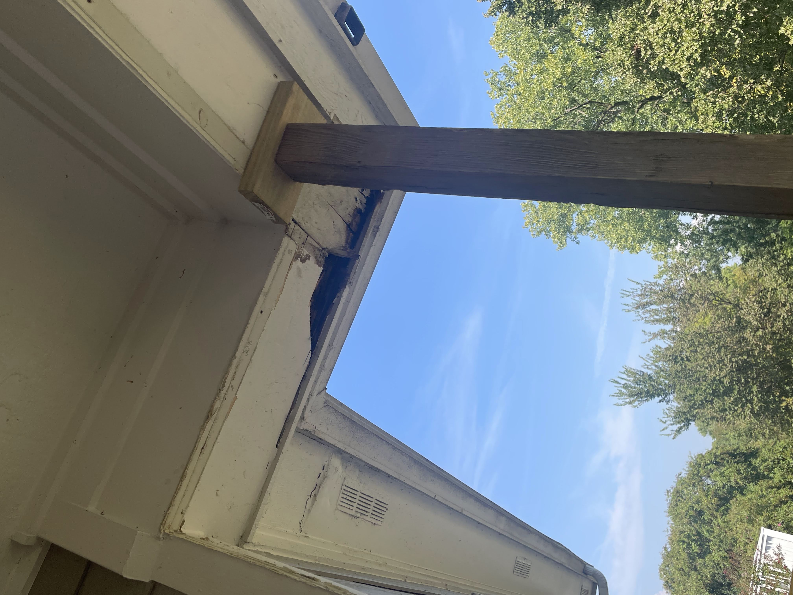
          <figcaption></figcaption>
       </figure>

       <figure style="width: 50%; text-align: center;">
          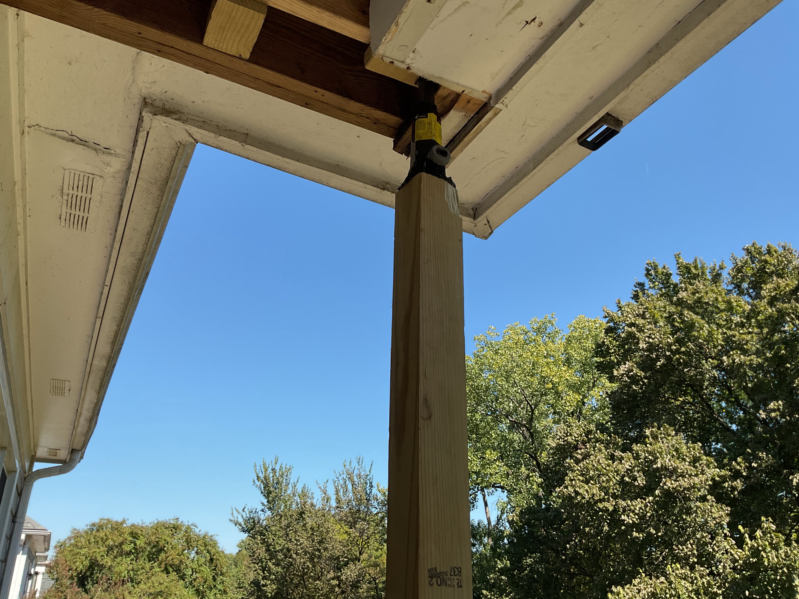
          <figcaption></figcaption>
       </figure>
    

1.  10/3/2025 - Had conversations with next door neighbors about how the previous owners "knew they needed to get to working on the deck" and "really want to get to the deck"
1.  Rotting on the beams in landing
1.  Stairs from landing to back yard
1.  Support beams for the balcony were sitting on top of the deck (did not go into the foundation) and were empty not up to code for supporting the balcony
    - Matt has since replaced those beams with structural schedule 40 that goes in the foundation past what is required for this area which brought the balcony back up to being level which was almost 3 inches
1.  Got the okay from my HOA that I did not need to submit an architectural request for the work being done
1.  Incorrectly poured footing on the stairs that lead to the backyard
    - The concrete was not poured all the way around the footer to where you could easily pull them out of the ground
1.  Missing handrail for the stairs to the backyard causing violations of shelby county code

## Foundation timeline

### All of the issues were missed by the home inspector and were not disclosed

1.  10/15/2025 Matt (contractor working on my deck remodel) noticed foundation issues

   <figure style="width: 50%; text-align: center;">
      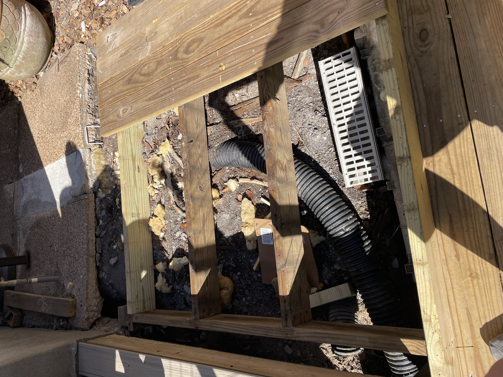
      <figcaption>
         Poly foam under landing by French drain that slopes toward the AC units and rotting beams under the wood.
      </figcaption>
   </figure>

   <figure style="width: 50%; text-align: center;">
      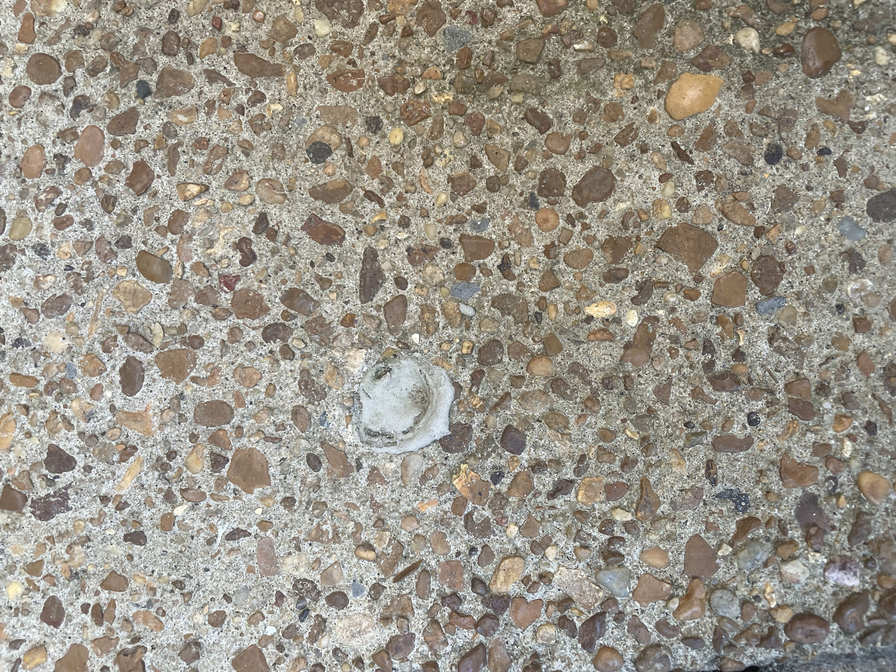
      <figcaption>
         Hole drilled into the walkway to pump poly fill under the sidewalk.
      </figcaption>
   </figure>

   <figure style="width: 50%; text-align: center;">
      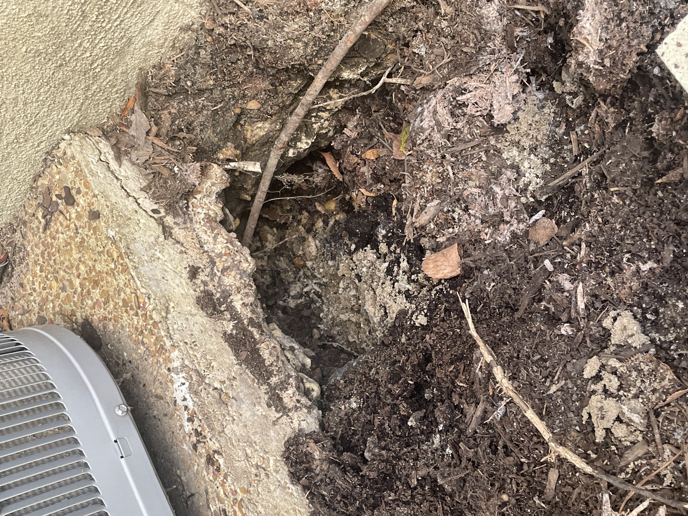
      <figcaption>
         Concrete was hollow under the AC units and contained a large hidden void filled with decorative rocks and covered with trash cans.
      </figcaption>
   </figure>

   <figure style="width: 50%; text-align: center;">
      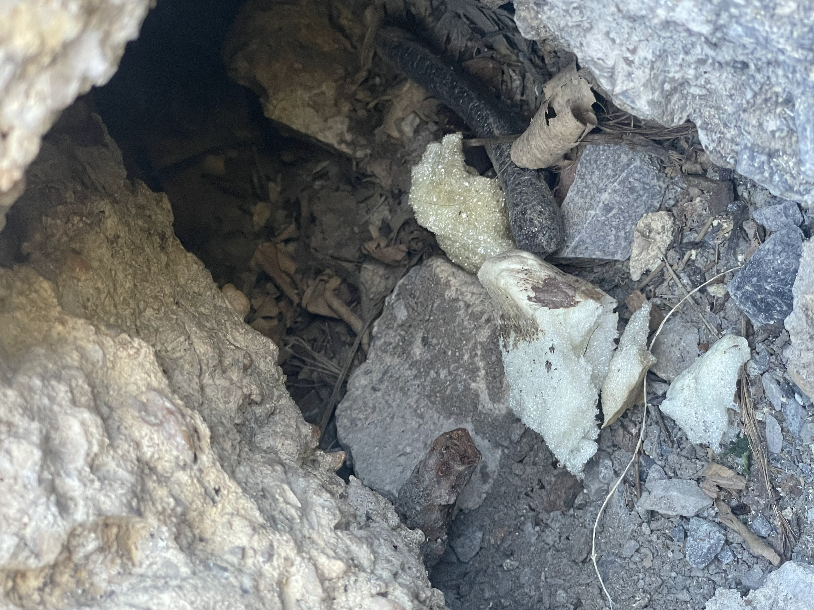
      <figcaption>
         Hole under the deck stairs/landing near the corner of the house with exposed rebar extending toward the AC-unit cavity. Clear signs of foundational fill sand erosion.
      </figcaption>
   </figure>

   <figure style="width: 50%; text-align: center;">
      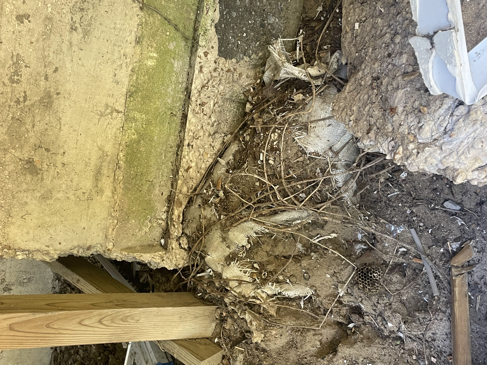
      <figcaption>
         Sandbags placed under the middle of the deck where additional erosion of foundation fill sand was visible.
      </figcaption>
   </figure>

   <figure style="width: 50%; text-align: center;">
      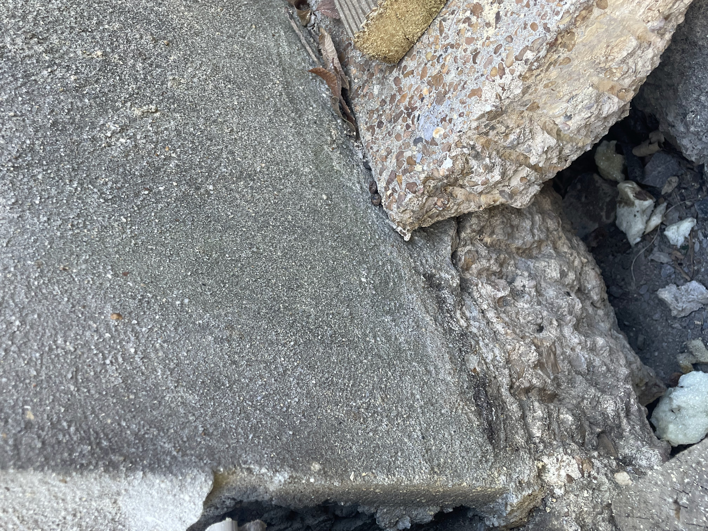
      <figcaption>
         Fresh skid installed to cover exposed foundation areas and conceal cracks or visible issues.
      </figcaption>
   </figure>

   <figure style="width: 50%; text-align: center;">
      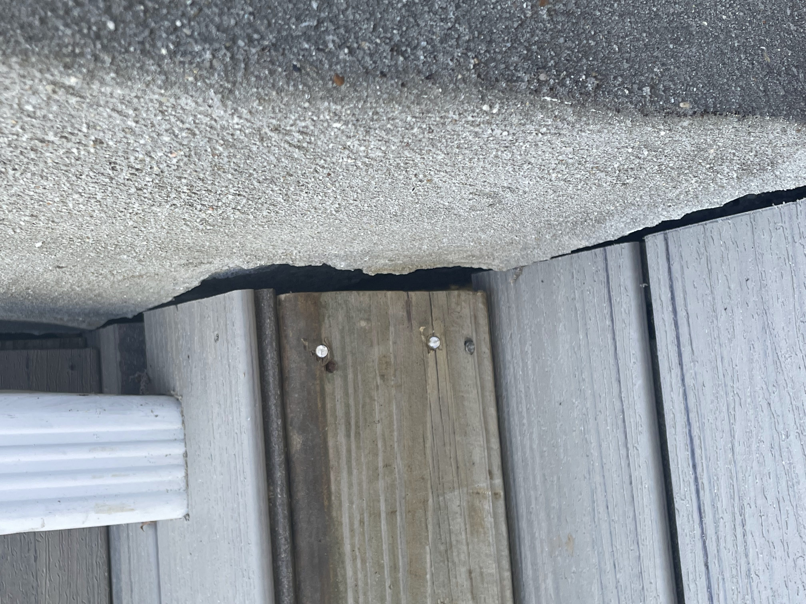
      <figcaption>
         Note: A clear sign this was used to hide foundation issues is that it was perfectly molded to the shape of the previous stairs.
      </figcaption>
   </figure>

1.  10/14/2025 - Neighbors mentioned previous owners had sidewalk cave in around the time of the house being put on the market
1.  11/20/2025 & 12/8/2025 - Emailed my HOA asking if there was past record of work done for where they repaved the conrete from being caved in, there was no records/disclourse
      

         <iframe src=".\pdfs\HOA.pdf" width="100%" height="600px" frameborder="0"></iframe>
      

1.  I noticed the downspout in the courtyard that is connected to the flower bed that is up against the whole under the AC unit was installed incorrectly where water from 1/3 of the house was gushing out of it and not only soakling the flower bed but stripping paint of the siding in that section only adding onto to more erosion in the hole. Matt noticed the current gutter guards that were installed by previous owners were allowing water to topple over it and not go down the drain during heavy rain.
    - 11/6/2025 - Matt fixed both of these issues by replacing all gutter guards and fixing the downspout to have the gutter properly connected to where water would not escape costing $600 for just the labor
      

         <figure style="width: 50%; text-align: center;">
            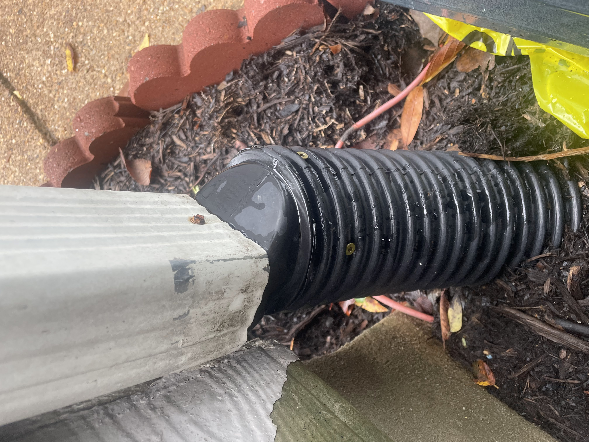
            <figcaption>
               Note: the gutter (white) should not be around the universal gutter (black)
            </figcaption>
         </figure>

         <figure style="width: 50%; text-align: center;">
            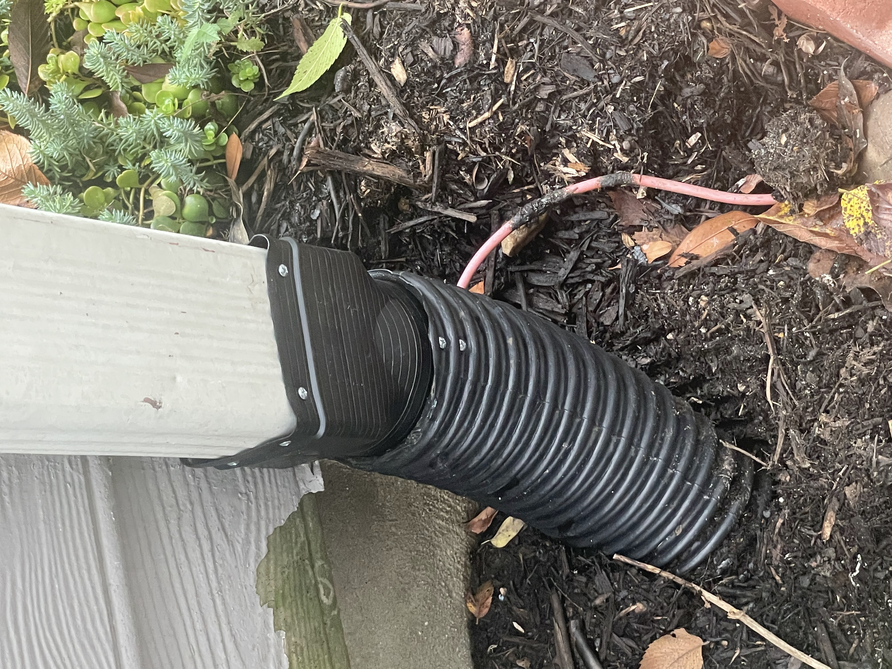
            <figcaption>
               Contractor Matt fixed the downspout
            </figcaption>
         </figure>
      

#### Getting quotes from foundation companies to diagnose issues we noticed

1.  10/23/2025 - Called DFX
    - Determined there was structural failure, said the failure was on the right side of the house (point of view of looking at the front of my house from the street).
    - Did not run any tests to give concrete evidence of how he came to the conclusion there was issues
    - Recommended push piers along the whole side of my house and putting in a drain and a pump by my AC units to ensure we remove water as fast as possible from that area

    

      <iframe src="./pdfs/foundation/dfx/Alex Cash_Updated DFX Agreement.pdf" width="100%" height="600px" frameborder="0"></iframe>
    

1.  10/28/2025 - Kermit B. Buck & Sons, INC.
    - Determined there was structural failure but was more focused on the hole under the AC unit. His main solution was seal the to spots under the deck where there is erosion. Then pump poly/flowable concrete into the hole until everything that was eroded was replaced and then monitor the first floor of the house for any issues getting worse than they already were

1.  10/30/2025 - Redeemers Group
    - Determined there was structural failure from the front to the back of the house, by using a laser level on the side of the house
    - Gave 3 recommendations on fixes, but overall recommended installing piers on a corner for better support
      

            <iframe src="./pdfs/foundation/redemers/Cash Redeemers Group, Inc. Proposal (Project 1, 10_30_25 1_09 pm).pdf" width="100%" height="600px" frameborder="0"></iframe>
            <iframe src="./pdfs/foundation/redemers/Cash Redeemers Group, Inc. Proposal (Project 2, 10_30_25 1_09 pm).pdf" width="100%" height="600px" frameborder="0"></iframe>
            <iframe src="./pdfs/foundation/redemers/Cash Redeemers Group, Inc. Proposal (Project 3, 10_30_25 1_09 pm).pdf" width="100%" height="600px" frameborder="0"></iframe>
      

1.  11/3/2025 - Olshan to come out for quotes
    - Olshan was the best plan for structural support across the whole house. Including external and internal pillars to ensure the area of influence of each pillar fixed my current issues and did not leave any gaps or areas where there could be future issues. The Olshan recommended plan putting 20 external pillars and 14 internal pillars costs $43,235.00 (not including cost to repair holes inside and rollup neighbors turf carpet to drill). I worked with them to create a modified plan to cover all the areas that are of high to medium priority that would include 13 external pillars and 6 internal pillars which costs $24,375.00 (not including cost to repair holes inside and rollup neighbors turf carpet to drill).
    - When Olshan came the guy (Tim) off the start told me he had been to this house before. He was the one who came and gave the quote and did the work on the sidewalk area that the previous owners had done. He was able to pull up the exact photos from his ipad when quoting and having the work done. Mentioned that he wanted to inspect inside the house but the owner did not let him and made him only stay outside and work on the sidewalk.
      

         <iframe src="./pdfs/foundation/olshan/Alex Cash, 946 River Landing Drive, 20251103_Customer Proposal.pdf" width="100%" height="600px" frameborder="0"></iframe>
      

    - When Tim was inspecting the inside of the house for cracks, issues with the doors/windows, etc. He noted that there were clear signs of covering up cracks with fresh painting (past owners replaced all windows, floors, and repainted right before selling the house)/new trim work.
    - Tim noted there was areas all throughout the first floor of the house where the grade was as bad as 3 inches below level
    - He also pointed out that there were spots in the house where there was evidence of foundational issues that had been covered up due to painting and putting in fresh molding/trim around the house
    - 12/5/2025 - Tim Hughes (thughes@olshanfoundation.com) sent "Exterior only" proposal — a separate proposal scoped to exterior perimeter work only
      

         <iframe src="./pdfs/foundation/olshan/Alex Cash, 946 River Landing Drive, 20251205_Customer Proposal.pdf" width="100%" height="600px" frameborder="0"></iframe>
      

    - 12/5/2025 - Tim Hughes also sent the prior owners' Olshan work documentation (quote given 11/19/2021, work done 12/2021)
      

         <iframe src="./pdfs/foundation/olshan/past/946 River Landing Drive , 20251205_Customer Proposal.pdf" width="100%" height="600px" frameborder="0"></iframe>
         <figcaption>
            The quote was given November 19th 2021 and the work was done in December of 2021
         </figcaption>
      

#### Getting quotes from hardwood flooring companies

- Artisant flooring
  - They no longer do hardwood floors (although was the recommendation from Olshan)
- Germantown Hardwood Floors
   <iframe src="./pdfs/flooring/germantownhardwoodfloorsinc.pdf" width="100%" height="600px" frameborder="0"></iframe>
- 11/25/2025 Mid South Flooring
    <iframe src="./pdfs/flooring/Mid_South_Flooring_LLC.pdf" width="100%" height="600px" frameborder="0"></iframe>
- Kings flooring (Never got back to me)
- Erick's flooring
    <iframe src="./pdfs/flooring/Ericks Flooring estimate 467.pdf" width="100%" height="600px" frameborder="0"></iframe>
- Old World Floors (Recommended from Arisant employee who I spoke to. Mentioned she has a friend use them)

#### Foundation work we have completed

1. 12/9/2025 - Olshan installed external pillings
1. 12/10/2025 - Olshan filled in the hole under my AC unit and Put concrete over the mulch bed that leads up to the AC unit to prevent further washout and erosion
1. 2/11/2026 - Received Olshan warranty documents from Gia Fox (Admin, Olshan Foundation Repair and Waterproofing)
   

      <iframe src="./pdfs/foundation/olshan/warranty/946 river landing dr.pdf" width="100%" height="600px" frameborder="0"></iframe>
   

1. 3/20/2026 - Olshan return visit at 3:00 PM (appointment set by care@olshanfoundation.com)
1. 4/21/2026 - Tim Hughes (Certified Structural Technician / Polyurethane Specialist) sent updated estimate
   

      <iframe src="./pdfs/foundation/olshan/Alex Cash, 946 River Landing Drive, 20260421_Customer Proposal.pdf" width="100%" height="600px" frameborder="0"></iframe>
   

#### Ozer Structural Engineering Foundation Assessment

1. 5/25/2026 - Paid Ozer Engineering $550 (Invoice #3129) for foundation assessment; site visit conducted 5/26/2026
1. 6/3/2026 - Ozer (Gerardo Mendez) requested copies of all previous settlement reports to compare with site visit findings. Sent them both Olshan proposals (11/3/2025 original and 4/21/2026 updated)
1. 6/10/2026 - Ozer asked to clarify which push piers had been installed and their installation dates
    - Clarified that Olshan installed **pilings, NOT push piers**
    - All exterior perimeter work in the "MODIFIED REPAIR PLAN" was completed December 8–10, 2025
    - The only change in the updated plan vs. original was one extra piling added to the bottom right section
1. 6/19/2026 - Ozer delivered completed initial foundation report
   

      <iframe src="./pdfs/ozer/946 River Landing DR report (initial).pdf" width="100%" height="600px" frameborder="0"></iframe>
   

1. 6/22/2026 - Ozer raised several concerns in their follow-up email:
    - Were not aware of a potential legal dispute; stated they would have priced the assessment differently or turned it away had they known
    - Stated the house does not appear to have experienced significant movement during my ownership
    - Stated that settlement alone does not constitute a foundation failure
    - Stated conditions observed during inspection did not indicate a structural safety concern
1. 6/23/2026 - Responded formally to Ozer pushing back and requesting a revised report:
    - Clarified Olshan's two separate periods of work on this property: December 2021 (sidewalk repair for prior owners only) and December 9–10, 2025 (foundation work I commissioned)
    - Clarified the potential legal dispute is against the **prior owners for non-disclosure**, not against any contractor or engineering firm
    - Called out that the initial report used vague language ("if you decide to address the cosmetic or functional concerns") with no consequences defined and no clear classification of conditions
    - Noted that employees on site 5/26 explicitly promised strong recommendations and clear next steps which were not reflected in the report
    - Asked specifically: Is there a foundation failure (yes or no)? Where are the most critical problem areas? What causes the differential settlement in the rear? What are the consequences of not acting?
    - Asked why Ozer's elevation measurements do not match Olshan's measurements
    - Formally requested a new or updated report addressing all these points
1. 6/26/2026 - Ozer acknowledged feedback and agreed to revise and update the report; promised delivery the following week
1. 6/30/2026 - Ozer delivered updated foundation report. Explained elevation measurement discrepancy: Ozer set one location as **0.0 inches** as their benchmark and measured all other elevations relative to that point; Olshan used a different reference point, which is why the numerical values differ even though the overall floor profile and settlement areas are similar
   

      <iframe src="./pdfs/ozer/946 River Landing DR report (updated).pdf" width="100%" height="600px" frameborder="0"></iframe>
   

#### [Attornies Called](https://www.memphisbar.org/?pg=FindaLawyer&dirAction=SearchResults&mg_gid=275434&seed=404851)

Type of attornies we are looking for are real estate litigators specializing in disclosure fraud, property misrepresentation, and nondisclosure

- [Crislip Philip](https://www.crislipphilip.com/real-estate/) 901-450-3299
  - Called left a message
- [The Stiles Law Firm](https://www.thestileslawfirm.com/)
  - Does not cover this practice area
- [Morgan Pettigrew](https://www.thepettigrewfirm.com/) 901 454 9930
  - Website under construction
  - Called left a message
  - Followed up from voicemail
    - Consultation fee is billed at the hourly rate. Rate is $375 per hour
    - Gave email should get intro info back
- [Snider and Horner](https://www.kevinsnider.com/) 901 751 3777
  - Referal from [Murphy DeZonia & Webb](https://mdwlaw.com/) who did our home closing
  - Consult fee $400
- [Gold Law Firm](https://www.dgoldlaw.com/real-estate-attorney-memphis/)
  - Only does car accidents and home closings
- [Harris Shelton](https://harrisshelton.com/) 901-525-1455
  - Talked to receptionist -> told to submit intake form -> waiting to hear back from form
- [Richard Myers](https://glankler.com/attorneys/richard-j-myers/) 901-576-1727
  - Talked to him, confirmed we have a case
  - Referd looking into [Porter Field with Birch Porter](https://www.bpjlaw.com/practice-area/real-estate-law/)
  - Has a $2500 retainer which equates to 8-9 hours
  - $375/hour
- [Burch Porter Johnson](https://www.bpjlaw.com/) 901 524 5000
  - Talked to receptionist and was forwarded to attorny's voicemail
  - receptionist -> Jackie Grecko -> voicemail
- [The Winchester Law Firm](https://thewinchesterlawfirm.com/) (901) 754-9994
  - The Winchester Law Firm has attorneys with extensive experience in real estate-related matters, including litigation of real estate and construction disputes, and one of their members — Richard E. Charlton III — specifically lists Investment Fraud and Real Estate Litigation among his practice areas.
  - receptionist -> voicemail
  - receptionist -> voicemail
- [Glassman, Wyatt, Tuttle & Cox, P.C.](gwtclaw.com) (901) 527-4673
  - Their real estate litigation attorneys handle disputes relating to brokers, agents, and their fiduciary and common law disclosure obligations, as well as alleged breaches in civil actions. Gwtclaw One of their attorneys has been named Lawyer of the Year for Real Estate Litigation in the Best Lawyers in America rankings. Gwtclaw
  - receptionist -> pass along info should hear back Monday
  - receptionist -> Sharron Mitchel voicemail
- [Mitchell Law Firm (Jed Mitchell)](jmitchlaw.com) (901) 268-6740
  - Mitchell Law Firm's consumer protection practice pursues claims for misrepresentation, hidden-fee schemes, and deceptive trade practices, enforcing the Tennessee Consumer Protection Act against businesses. Jmitchlaw This could be a strong angle if your disclosure fraud claim involves willful concealment.
  - voicemail
  - voicemail

## House upgrades

| **Upgrade**                                                                                                      | **Year** | **Cost** |
| ---------------------------------------------------------------------------------------------------------------- | -------- | -------- |
| Kitchen sink/faucet                                                                                              | 2025     |          |
| Kitchen handles                                                                                                  | 2025     |          |
| Kitchen overhead light                                                                                           | 2025     |          |
| Overhead stairs light                                                                                            | 2025     |          |
| Add box for loose wire in attic                                                                                  | 2025     |          |
| Outdoor flood light                                                                                              | 2025     |          |
| Replace courtyard/deck outdoor lights                                                                            | 2025     |          |
| Dining room overhead light                                                                                       | 2025     |          |
| Gutter guards                                                                                                    | 2025     |          |
| Courtyard downspout                                                                                              | 2025     |          |
| Deck/balcony (fix rot, new railing, upgrade to Trex, new ceiling fan)                                            | 2025     |          |
| Ceiling fans (master, living room, deck)                                                                         | 2025     |          |
| Downstairs bathroom (paint vanity, new quartz sink, paint walls, towel holder, TP holder, hand towel holder)     | 2025     |          |
| Water shut-offs (downstairs & guest bathrooms)                                                                   | 2025     |          |
| External pillings on the foundation                                                                              | 2025     |          |
| Paint garage                                                                                                     | 2025     |          |
| 2× garage door opener                                                                                            | 2025     |          |
| Re-caulk/replace siding                                                                                          | 2025     |          |
| Replace light switches (downstairs hallway)                                                                      | 2025     |          |
| Caulking driveway control joints                                                                                 | 2025     |          |
| Replace master bath shower head                                                                                  | 2025     |          |
| Add missing GFCI in upstairs guest bathroom                                                                      | 2025     |          |
| Add missing GFCI in master bathroom                                                                              | 2025     |          |
| Add footrail to bar                                                                                              | 2025     |          |
| Re-caulk entire kitchen backsplash                                                                               | 2025     |          |
| Caulk granite countertop slab on the right of oven (was never caulked and if weight was applied it would pop up) | 2025     |          |
| Label fuze box                                                                                                   | 2025     |          |
| Fix chimney flashing                                                                                             | 2025     |          |
| Replace gutter on the back deck                                                                                  | 2025     |          |
| Fix/replace rotted wood that holds up the back gate                                                              | 2025     |          |
| Fix dryer lint connection to the wall (was never connected to exaust and lint was going into the wall)           | 2025     |          |
| Replace kitchen, dining room, stairway, and upstairs hallway switches and faceplates                             | 2026     |          |
| Replace all door hinges to be consistent color, shape, and size                                                  | 2026     |          |
| Replace ceiling fan in office                                                                                    | 2026     |          |
| Replace ceiling fan in breakfast nook                                                                            | 2026     |          |
| Fix/fill hole with insulation that was left open under generator hookup in office closet                         | 2026     |          |
| Replace all interior door handles                                                                                | 2026     |          |
| Fix deck landing ( removed rotted boards and footing)                                                            | 2026     |          |
| Sealed and painted the deck supports                                                                             | 2026     |          |
| Fix and paint island/kitchen                                                                                     | 2026     |          |
| Replace light switches and faceplates by frontdoor and in the understairs closet                                 | 2026     |          |
| Painted woodframe around the deck ceiling                                                                        | 2026     |          |
| Remove paint that was on stairs and caulked both sides                                                           | 2026     |          |
| Installed Blink security cameras                                                                                 | 2026     |          |
| Installed Blink doorbell                                                                                         | 2026     |          |
| Finished railing on the deck                                                                                     | 2026     |          |

## House TODO

- Replace all blinds
- Touchup paint on front door
- Replace light switches in living room, and upstairs
- Replace light switch and disposal switch in kitchen
- Paint upstairs guest bathroom
- Install handtowel holder in upstairs guest bathroom
- Install towel hooks in upstairs guest bathroom
- Rig the back gate up to always close if left open
- Fix ceiling paint in masterbed room
- Fix rotting on the wood on both sides of the front door
- deck stairs
- deck lattus frame
